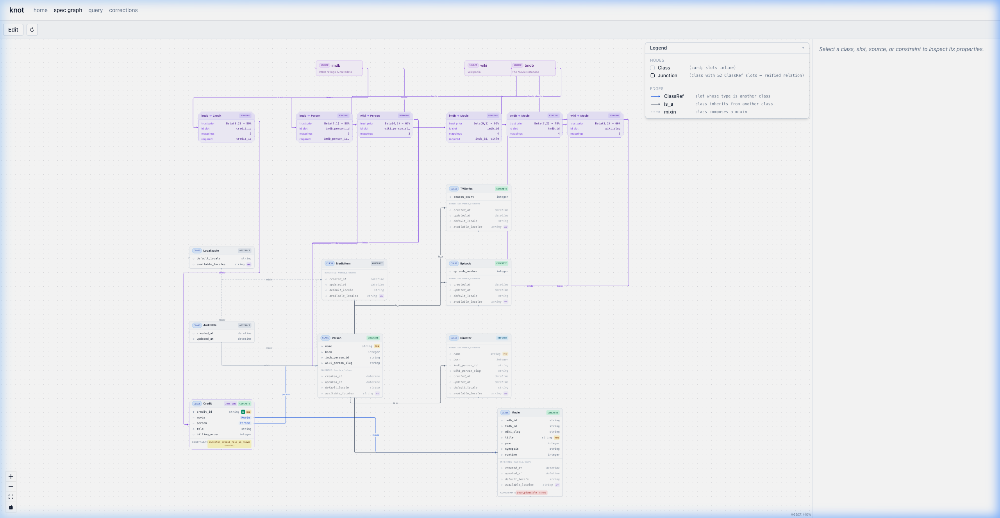
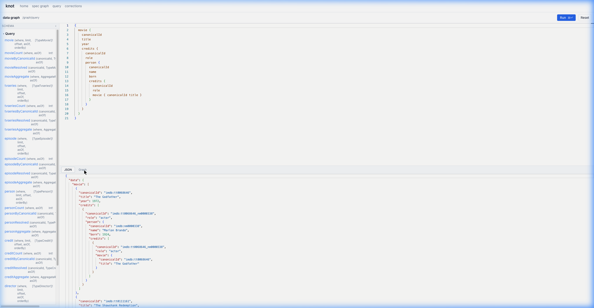
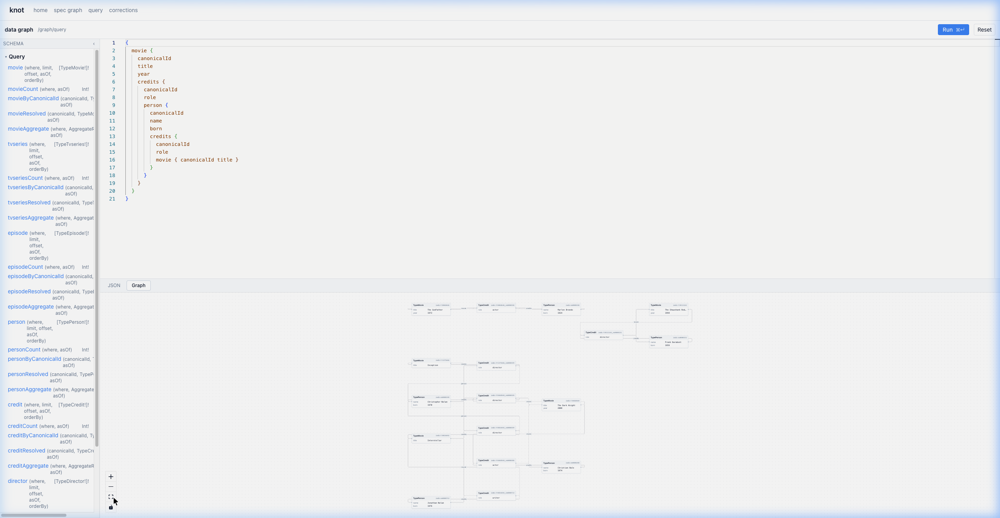
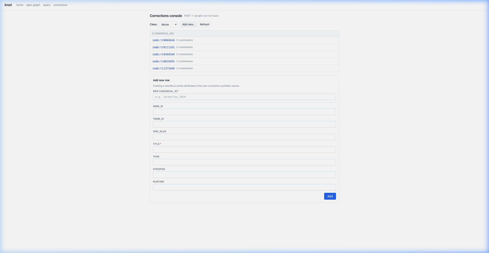

# RFC: Hitch Ontology Compiler - KNOT

**Author(s):** Nick Ouellet  
**Date:** 2026-05-12  
**Status:** Draft  
**Reviewers:** *[Add Reviewers]*  
**Approvers:** *[Add Approvers]*  

## Abstract

This RFC proposes the design and implementation of **knot**, a unified service that replaces the existing bifurcated approach to data pipelines and ontology management. Currently, the system suffers from a pipeline/ontology split where ontologies are descriptive but operationally inert, leading to implicit schemas in code and high coordination costs. Knot solves this by treating the ontology as the single executable source of truth. From a single declarative spec, knot mechanically projects all downstream artifacts—including Postgres DDL, GraphQL surfaces, ingest validators, and constraint SQL—ensuring complete alignment between the running system and its schema.

**knot is a reflective ontology compiler as a service.**

## Background: Deficiencies of the Current System

In the existing CKG, data management and ontology management live on two structurally unconnected axes. The ontology and the data pipelines act as *peers* rather than parent and child, resulting in competing sources of truth. This leads to eight critical failure modes:

*   **The Pipeline / Ontology Split:** The data pipeline runs lake-side via managed jobs, while the ontology is source-controlled turtle (RDF). The ontology is read by humans but is operationally inert. Nothing forces the pipeline and the ontology into agreement.
*   **Descriptive, Not Executable Ontologies:** The turtle files name classes and slots but cannot carry source-to-slot mappings, constraints, or trust priors. The pipeline inevitably encodes its own implicit schema in code, leaving the ontology with no causal power.
*   **High Coordination Costs for New Sources:** Onboarding a new source today requires touching multiple independent systems (ingestion, ER, materialization, ontology edits), each with different owners and release cadences. 
*   **Scattered, Un-Queryable Constraints:** A constraint requires knowledge of the ontology, storage layout, and enforcement timing. Because no single place owns all of this context, validation rules live in hand-written code coupled to specific storage layouts, making them impossible to share, inherit, or query.
*   **No Resolution for Source Collisions:** When multiple sources contribute conflicting values for the same slot on the same entity, the current system has no principled way to choose. Whichever pipeline ran last wins, or a hard-coded priority list is maintained manually — neither scales, and neither adapts.
*   **No Evolving Trust Model:** Source reliability is static and implicit. There is no mechanism to learn which sources are accurate on which slots over time, and no feedback loop from corrections back to ingestion quality.
*   **No Structured Feedback Path for ER:** Entity resolution quality is difficult to measure or improve because corrections and merge/split decisions are not recorded in a structured, queryable form that could feed back into ER model training.
*   **Daily-Pipeline Latency:** Consumer-facing changes (corrections, new ingestions, ER decisions) cannot be reflected in the graph until the next daily pipeline run completes. The system has no capacity for real-time or near-real-time updates.

## Goals and Non-Goals

### Goals
*   **Ontology as Single Source of Truth:** Treat the ontology as the single executable source of truth for the entire pipeline.
*   **Mechanical Projection:** Guarantee that downstream artifacts (DDL, GraphQL, constraints, ingest validators) are mechanically projected from a single spec.
*   **Unified Runtime & Automatic Validation:** Unify ingest, validation, and querying behind one service. Because all data is ingested via the API and validated against compiler-emitted Pydantic models and constraint SQL, the ontology actively governs ingestion. This automatically blocks invalid data at the door—a massive upgrade over the existing setup where validation is scattered across hand-written pipelines.
*   **Reflective Validation:** Enable safe, reflective editing of the spec validated against the live running system state.

### Non-Goals
*   **Heavy Adjacency Traversals:** Replacing graph databases (e.g., Neo4j) for workloads optimized purely for complex multi-hop graph traversals.
*   **Decoupled Pipelines:** Supporting or maintaining lake-side data pipelines that operate independently of the ontology.
*   **Generalized Semantic Layer:** Building a generalized semantic layer intended for arbitrary external query backends (unlike tools like DataJunction).

## What knot is, concretely

Knot is a service whose only declarative state is a single versioned, typed spec — naming the graph's classes (concrete, abstract, defined) with their slots, sources, source-bindings (with per-slot mappings and trust priors), and constraints — and whose compiler emits every runtime artifact (DDL, GraphQL surface, ingest validators, constraint SQL, and materialization views) as a mechanical projection of that spec.

## Why "reflective"

The compiler validates each spec edit against the *running system* that will execute it — not against a static schema, not against CI fixtures. When a curator drafts an edit ("add slot `Movie.trailer_url`", "tighten constraint X", "rebind the wiki source to ingest synopsis"), the publish gate consults the active trust policy, the source watermarks (what's already in the lake), the published-spec hash, and the bound configs. CI cannot do this work because CI does not hold any of that state. The validator and the interpreter being the same runtime is what makes "edit the spec while it's running" safe — and what makes it possible for the ontology to be the source of truth rather than a parallel description that has to be reconciled.

## Proposed Architecture

Knot is a single FastAPI service backed by PostgreSQL. Both the control plane (managing the spec) and the data plane (the actual knowledge graph data) live in the same Postgres instance, ensuring transactional consistency between schema edits and data.

### 1. The Compiler Pipeline
The compiler is a pure, side-effect-free pipeline: it takes a typed entity tree as input and outputs SQL composables. It features three primary emitters:
*   **Postgres DDL Emitter:** Generates `CREATE TABLE`, `CREATE VIEW`, `CREATE INDEX`, and `CREATE CONSTRAINT` statements per class.
*   **GraphQL Schema Emitter:** Projects Strawberry GraphQL types directly from the class definitions, ensuring the query surface always matches the storage layout.
*   **Constraint SQL Emitter:** Uses `sqlglot` to validate constraint predicates and compiles them into violation-shape `SELECT` queries that run over the per-class tables.

### 2. The Runtime Components
The runtime environment is composed of four distinct layers:

*   **Spec Store (Control Plane):** Manages draft and published specs as typed Pydantic values. Every revision is tracked using Slowly Changing Dimensions Type 2 (SCD2) for full auditability. Spec mutations (draft creation, class/source edits, publish) are restricted to the core ontology team; downstream consumers interact only with the data plane (ingest, query, corrections).
*   **Ingest Path:** Exposes a dedicated REST endpoint per configured source. Because knot compiles the ontology directly into typed models and SQL constraints, incoming rows are strictly and automatically validated against the single source of truth *before* being written to the SCD2 bindings table. This entirely eliminates the need for parallel, hand-written validation pipelines. (Entity Resolution and other domain logic are delegated to external extensions).
*   **Query Surface:** Exposes a Strawberry GraphQL API over `psycopg`. Incoming GraphQL query nodes are compiled to optimized SQL on demand.
*   **Extension Surface:** A priority-ordered, typed event bus. The ingest path emits two lifecycle events — `RowsIngesting` (pre-INSERT, mutable) and `RowsIngested` (post-INSERT, read-only). Extension handlers register via `@dispatch.on(EventType, priority=N)` and receive both the event payload (source, binding, typed rows) and a `Session` façade that provides connection-bound access to every `knot.db` submodule (corrections, DQ, trust posteriors, etc.). Handlers that need external services (e.g., the ER shim) use conditional registration: if `KNOT_ER_URL` is not set, no handler fires and the code path is never touched — zero overhead for teams that don't use it. The sibling `er/` (`:8002`) and `ai/` (`:8001`) services are standalone FastAPI processes that talk to knot exclusively over HTTP and never import the `knot` Python package.

### 3. Execution Model & Storage Layout
Knot itself does not run background jobs or pipelines. Domain-specific workflows are executed by extension handlers that fire synchronously inside the ingest transaction (pre-INSERT handlers can mutate rows or set canonical IDs; post-INSERT handlers can audit, push to Kafka, or record trust feedback) or by external sibling services invoked via HTTP.

At the storage layer, the data plane consists of:
*   **Concrete Classes:** Mapped to one "source-rows" table + one SCD2 bindings table.
*   **Defined Classes:** Mapped to a SQL `VIEW` that dynamically evaluates its predicate against the concrete tables.

### 4. Schema Migration

Knot does not use Alembic or any external migration tool. Instead, every spec publish runs a built-in diff engine (`diff_specs(prev, candidate)`) that compares the previous and candidate specs and emits a list of typed `Change` records. Each change falls into one of three buckets:

*   **Bucket A — DDL-destructive.** Storage shape changes that may lose data (e.g., `DropClass`, `DropSlot`, `ChangeSlotTypeExpression`, `DropSource`). The publish gate **refuses** these unless the caller explicitly sets `allow_destructive=true`, ensuring no silent data loss.
*   **Bucket B — Data-revalidation.** Constraint tightenings (e.g., `ChangeSlotPattern`, `ChangeSlotMinimum`, `ChangeConstraintBody`). These produce no DDL themselves, but the publish gate re-runs every new or changed constraint against the current data plane before allowing the publish — rows that would violate the new rules are surfaced as errors.
*   **Bucket C — Spec-only / runtime.** Changes that affect runtime behavior but not storage (e.g., `ChangeSlotResolutionPolicy`, `ChangeSourceBindingTrust`, `AddSource`). These are recorded for audit but emit no DDL.

The migration emitter dispatches DDL per change type: `CREATE TABLE`, `ALTER TABLE ADD/DROP COLUMN`, `ALTER COLUMN TYPE … USING`, `CREATE OR REPLACE VIEW`, `RENAME TABLE`, `RENAME COLUMN`, etc. All DDL runs inside the same transaction as the spec revision bump, so a failed migration atomically rolls back both the schema change and the spec edit.

The `preview` endpoint exposes this entire pipeline as a dry run: it diffs the draft against the published spec and returns the typed change list, whether `allow_destructive` is required, and any constraint violations — without executing DDL. This lets curators inspect the exact impact of a spec edit before committing it.

### 5. Trust Resolution

When multiple sources contribute values for the same slot on the same entity, knot resolves the conflict at **query time** — not write time. Each slot in the spec declares a `resolution_policy`; three policies are implemented today:

*   **`ARGMAX_TRUST`** — highest scalar trust score wins (human-set per-source via `trust_config`, doesn't learn). Tie-break by source name for determinism.
*   **`POSTERIOR_MEAN`** — each `(source, slot)` pair maintains a Beta(α, β) posterior. Corrections increment α (success) or β (failure) via atomic UPSERT. Resolution picks the source with the highest posterior mean α/(α+β). Learns from every correction; deterministic and monotone in observations.
*   **`LCB` (Lower Confidence Bound)** — same Beta posteriors, but penalises sources with few observations by selecting argmax(mean − k·stddev). Conservative: prefers well-known sources over high-mean but uncertain newcomers.

Multi-valued (array) slots skip the policy entirely: the resolved value is the deduplicated union of all per-source contributions.

All three policies are deterministic — same state, same answer. The posteriors are the system's memory; corrections are the feedback signal; queries are pure reads over that state.

### 6. Corrections

Corrections are typed mutations that fix or override data-plane values outside of normal ingestion. Four correction types are supported: `property` (override a single value), `merge` (collapse two canonical IDs), `split` (separate a canonical ID into two), and `add` (insert a row attributed to the synthetic `_user_corrections` source).

Each correction is processed as a single atomic transaction that executes three steps:
1.  **Audit row** — an immutable entry in `_user_corrections` recording the correction type, payload, and the principal who submitted it.
2.  **Data-plane mutation** — the SCD2 bindings table is updated (close old binding, open new) and/or the source-rows table is written to, depending on the correction type.
3.  **Bandit feedback** — for slot corrections, a negative Bernoulli observation is recorded against the source that provided the overridden value, updating its Beta posterior. This closes the loop: corrections make the trust model learn which sources are unreliable on which slots.

### 7. Data Quality Observations

Knot maintains a `dq_observations` table with per-(source, class, slot) statistics. Two write paths feed it:

*   **Incremental** — every ingest batch and every row-mutating correction automatically emits one observation row per affected stored slot, recording `row_count`, `null_count`, `distinct_count`, `min_value`, and `max_value`. This runs in the request thread with zero additional queries against the data plane (stats are computed from the in-memory batch).
*   **Full scan** — `POST /dq/scan` runs an aggregate query against every per-class table for the published spec, producing a point-in-time snapshot. Intended for periodic cron-style monitoring.

Read paths (`query_observations`, `summarize`) support time-windowed, per-source/class/slot filtering, giving ops a "null rate is climbing on IMDB's `synopsis` field" signal without any external monitoring tool.

## Examples — building up a spec

Below we build a small spec from nothing and watch the running system grow at each step. The domain is intentionally tiny — a movie database — so the conceptual moves stand out. The screenshot below shows the fully built-out spec graph from a live instance; each step below adds one element to this picture.



### 1. A single class

Declare `Movie` with a handful of slots: `title`, `year`, `runtime`. The compiler emits a `movie` table in the data plane (one column per slot, plus knot's system columns for provenance and history) and a `movie` field on the GraphQL surface that returns rows.

### 2. A source binding

Declare an `imdb` source and bind it to `Movie`, mapping IMDB's field names (`primaryTitle`, `startYear`) to our slots. Posting IMDB rows to the ingest endpoint now validates them through the binding's mapping and lands them in the `movie` table; GraphQL reads return them.

### 3. Inheritance

Add an abstract `MediaItem` class that `Movie` (and later `TVSeries`, `Episode`) declare via `is_a`. `MediaItem` itself has no table — only concrete descendants do — but its slots, its mixins, and its constraints flow to every descendant automatically.

### 4. A mixin

Declare an `Auditable` mixin with `created_at` / `updated_at` and apply it to `MediaItem`. Every concrete descendant gains those two columns; no separate `auditable` table appears — mixins are slot-bundles that get pulled in, not parallel tables.

### 5. A reified relation

Declare `Credit` as its own class with two relation-typed slots (`movie` → `Movie`, `person` → `Person`) plus `role` and `billing_order`. `Credit` gets its own table and its own ingestion path; the GraphQL surface lets you traverse `Movie → credits → Person` and back, with the relation's own slots available along the edge.

### 6. A defined class

Declare `Director` as "a `Person` where there exists a `Credit` with `role='director'`". The compiler emits a SQL VIEW (not a table) over `Person` filtered by that predicate, and the GraphQL surface gains a `director` field that returns only matching Persons — refreshed automatically as new `Credit`s arrive.

### 7. A constraint with inheritance

Attach a constraint to `MediaItem`: `year` between `1888` and `now + 5 years`, severity error. The predicate is a SQL string (validated at publish time); ingest enforces it batch-wise (rolling back violators), and the publish gate revalidates against existing data before any spec edit lands. Because `Movie` is_a `MediaItem`, it inherits this constraint automatically — no per-class duplication.

### 8. The query surface

A consumer never sees postgres or hand-written SQL: the published spec produces a GraphQL surface with one root field per concrete or defined class (`movie`, `person`, `credit`, `director`, ...), each filterable by slot, joinable by relation, projectable. The same spec that produces the storage layout produces the read surface; they cannot drift. Even sophisticated multi-hop queries — `Movie → Credit → Person → Credits → Movie` — work out of the box, closing loops and returning nested JSON:



The same result rendered as an interactive graph, showing entities as typed nodes and relations as labeled edges:



### 9. Ingesting Data

Because knot compiles the ontology directly into typed validators, ingestion is a simple REST call. A client posts a batch of rows attributed to a specific source binding (e.g., `imdb`). Knot automatically maps the fields, validates the batch against the `Movie` schema, enforces constraints, and lands the data.

```json
POST /graph/ingest/imdb?class_name=Movie
{
  "rows": [
    {
      "primaryTitle": "The Godfather",
      "startYear": 1972,
      "runtimeMinutes": 175
    }
  ]
}
```

### 10. Manual Corrections

If automated ingestion gets a slot wrong, a curator (or an LLM extension) can submit a typed correction. The correction atomically writes an audit row, mutates the data plane, and registers negative bandit feedback against the source that provided the bad data, ensuring the system learns over time.



```json
POST /graph/corrections
{
  "type": "property",
  "class_name": "Movie",
  "canonical_id": "imdb:tt0068646",
  "property": "year",
  "value": 1973
}
```

## What knot is NOT

Each comparator does part of what knot does well; none unify all four problems above.

- **RDF + SHACL + turtle files** — exactly what the existing CKG has. Strong ontology vocabulary, real validation language, no runtime; you still need a separate pipeline to produce the data, and validation lives in a separate process from storage. The pipeline/ontology split is *baked in* by this approach.
- **LinkML** — closest at the model level. Generates Pydantic, JSON Schema, SQL DDL from a YAML spec. Stops at code generation: doesn't host a service, doesn't manage runtime state, doesn't validate edits against the running system, doesn't unify ingest + query + constraint behind one spec. Knot's metaschema borrowed structural ideas from LinkML and then diverged where the unified-runtime requirement forced different choices.
- **dbt** — a SQL compiler with a model graph and a test framework. The model graph isn't an ontology: no class/slot/relation typing, no defined-class predicates, no trust resolution, no source-binding-as-data. dbt is the comparator for *the lake-side pipeline knot replaces*, not for the ontology layer.
- **DataJunction** — closest spiritual comparator: a semantic-layer service that compiles spec edits to artifacts. But DJ optimizes for query-time semantic models over many backends; knot optimizes for write-time ontology + ingest unification in a single postgres. Different problem.
- **Graph DBs (Neo4j, TigerGraph, etc.)** — strong on adjacency-heavy workloads, weak on per-slot trust reconciliation, schema-as-data, and constraint-as-data. We chose postgres because the data is rectangular with reified relations, not because we needed adjacency primitives.

The shape of knot's contribution: an ontology compiler with a postgres-native execution model, validation against runtime state, and source-bindings / trust / constraints as first-class spec content.

## Appendix: Proposed API Routes

The service exposes a unified REST/GraphQL surface that cleanly separates the Control Plane (spec management) from the Data Plane (graph operations). 

### Control Plane (`/spec/*`)
*   **`GET /spec/published`**: Retrieve the currently active, compiled specification.
*   **`POST /spec/graphql`**: Query the structure of the published spec itself (the metamodel).
*   **`POST /spec/drafts`**: Create an isolated draft for ontology edits.
*   **`POST /spec/drafts/{id}/classes` (and `/sources`, `/source_bindings`, `/constraints`)**: Mutate the draft ontology.
*   **`POST /spec/drafts/{id}/_validate_constraint`**: Test a raw constraint SQL predicate via `sqlglot` against the draft's schema.
*   **`POST /spec/drafts/{id}/preview`**: Dry-run publish gates to check if the draft is valid and diff the proposed schema changes.
*   **`POST /spec/drafts/{id}/publish`**: Transactionally compile the draft, emit Postgres DDL and Pydantic validators, and promote it to the active spec.

### Data Plane (`/graph/*`)
*   **`POST /graph/query`**: Execute a Strawberry GraphQL query against the published knowledge graph data.
*   **`POST /graph/ingest/{source_name}`**: Push a batch of rows. Rows are strictly validated against compiler-emitted schemas derived from the published spec before hitting the database.
*   **`GET /graph/classes/{class_name}/{canonical_id}`**: Retrieve all raw, per-source contributions for an entity.
*   **`GET /graph/classes/{class_name}/{canonical_id}/resolved`**: Retrieve the single, trust-resolved record for an entity.
*   **`POST /graph/corrections`**: Manually submit a typed correction (e.g., merge, split, slot override) with immediate bandit feedback.
*   **`POST /graph/constraints/check`**: Run all published constraints against the current data plane, returning offending rows.

### Extensions & Ops (`/dq/*`, `/lake/*`)
*   **`POST /dq/scan`**: Trigger a full-scan snapshot of per-(source, class, slot) data quality stats. Supports `source` and `class_name` filters.
*   **`GET /dq/observations`**: Query the DQ time-series with optional filters (source, class, slot, time window, kind).
*   **`GET /dq/summary`**: Roll-up view: total rows, total nulls, and null rate per (source, class, slot) over a time window.
*   **`GET /lake/materialize`**: Generate target-dialect SELECT queries for exporting resolved graph state to a data lake.
