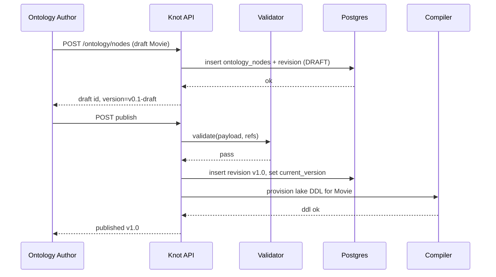
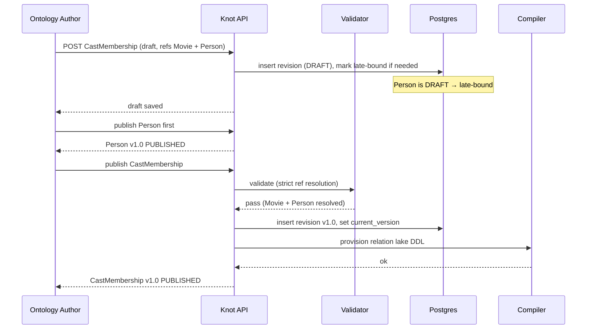
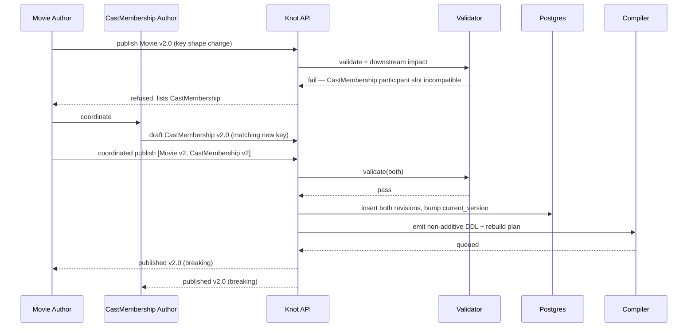

> ⚠️ **LEGACY / UNVERIFIED.** This document was authored during the prototype/exploration phase and has not been reconciled against the current codebase. Treat as historical context, not specification. Cross-check anything you intend to act on. See [`../README.md`](../README.md) for the current entry point.


# Data node lifecycle

Scope: the four sub-lifecycles for `kind='data'` ontology nodes —
new entity, entity changed, new relation, relation changed. Both
entities and relations are LinkML classes submitted as a single node
at a time. Relations are reified: each relation node has explicit
participant slots (always entity-type refs) plus its own property
slots (Option B from the relation-modeling pass).

Locked decisions assumed throughout: revisions are full snapshots;
DRAFT vs PUBLISHED states; `is_breaking` is computed at write time
via structural diff; the static pre-flight validator gates all
publishing; late binding is allowed in DRAFT but strictly resolved at
publish; each class materializes to a per-source layer + resolved
layer in the lake.

Conventions used below:
- "Validator" = the static pre-flight validator (the gate).
- "Compiler" = the materialization compiler that emits SQL + job spec.
- "Orchestrator" = whichever `Orchestrator` plugin is wired (Maestro,
  in-tree default, etc.).
- DRAFT = revision exists with `current_version` not pointing at it
  (or pointing at a prior `vMAJOR.MINOR-draft` semantic — exact
  encoding is an open question, see end).
- PUBLISHED = `ontology_nodes.current_version` points at this revision.

---

## New entity defined

### Pre-state
- No `ontology_nodes` row named `Movie`.
- Some downstream pipeline author already wants a `Movie` type to
  reference; they are blocked or stubbing.

### Actor
- **Ontology Author** (Persona 1).

### Trigger
- Author opens the LinkML editor, writes a `Movie` class with slots
  (`title: string [required]`, `release_year: integer`,
  `runtime_minutes: integer`, identifier slot, etc.), saves as draft.

### Steps
1. **Action:** `POST /ontology/nodes` with `{name: "Movie",
   kind: "data", payload: <linkml-class>}` and `state=draft`.
2. **Knot response:** insert `ontology_nodes` row (umbrella);
   `current_version` stays NULL. Insert
   `ontology_node_revisions` row with `version='v0.1-draft'` (or
   equivalent), `is_breaking=false` (no parent), `parent_revision_id`
   NULL, `content_hash` computed, `payload` stored as JSONB. Append
   `history` row `activity_type='created'`.
   **State change:** node exists, has a draft revision, no published
   revision yet.
3. **Action:** author iterates — saves new drafts. Each save is a new
   revision row (full snapshot, append-only). Identical resubmissions
   collapse via `content_hash`.
4. **Action:** author hits "publish".
5. **Knot response:** validator runs over the draft payload. For a
   net-new entity with no upstream/downstream refs, the relevant
   checks are:
   - **Ontology conformance** — class is valid LinkML, slot types
     are valid SQL-mappable types.
   - **Type compatibility** — declared types are coherent.
   - **Authorization** — caller has write permission on the namespace.
   - **DAG completeness** — trivial (no deps yet).
   - SQL/plugin/DQ checks — N/A for a pure shape definition.
6. **Knot response (on validator pass):** insert a new revision row
   with `version='v1.0'`, `is_breaking=false` (first publish is not a
   breaking change against nothing), `parent_revision_id` set to the
   last draft. Update `ontology_nodes.current_version='v1.0'`. Append
   `history` row `activity_type='published'`.
   **State change:** PUBLISHED, `current_version` set.
7. **Knot response:** compiler precomputes per-source layer and
   resolved layer DDL for the `Movie` class. No data yet — the lake
   tables exist as empty schemas keyed by the resolved class shape,
   ready for the first source's Normalize stage to write into.
8. **Downstream unblock:** any pipeline node, source mapping, or
   relation that wants to reference `Movie` can now do so with a
   resolved (not late-bound) reference.

### Post-state
- `ontology_nodes(name='Movie', kind='data', current_version='v1.0')`.
- One PUBLISHED revision; possibly a chain of DRAFT revisions before it.
- Empty per-source + resolved lake tables provisioned.
- `node_dependencies` empty for `Movie` (no upstream sources mapped yet).

### Failure modes
- **Validator rejects ontology conformance** (e.g., slot `release_year`
  declared as `string` but constrained as a year integer) — publish
  is refused; revision stays DRAFT; structured error returned with
  path + remediation hint for the UI.
- **Authorization fail** — caller can read but not publish in the
  namespace. Refused; no state change.
- **Name collision** — `name` is UNIQUE on `ontology_nodes`. Insert
  fails at step 2.
- **Late-bound reference in draft is fine**; an unresolved reference
  blocks publishing only.

### Sequence



---

## Entity changed

Two flavors. The structural diff classifies them automatically and
writes `is_breaking` on the revision row.

### Additive change (new optional slot)

#### Pre-state
- `Movie` PUBLISHED at `v1.0`. Downstream: source mappings, relation
  nodes (`CastMembership.movie -> Movie`), pipelines that read Movie.

#### Actor
- Ontology Author.

#### Trigger
- Author wants to add `tagline: string` (optional) to `Movie`.

#### Steps
1. **Action:** edit Movie payload, save draft.
2. **Knot response:** new draft revision row; `parent_revision_id` =
   current published v1.0. Structural diff vs parent: only
   "added optional slot." `is_breaking=false`. Computed semver bump
   target = `v1.1` (minor).
3. **Action:** publish.
4. **Knot response:** validator runs:
   - Ontology conformance on the new payload.
   - DAG: still resolves; downstream nodes reference Movie by name,
     not by slot, so no broken refs.
   - Type compat: new optional slot, projected type is well-defined.
   - DQ-check SQL referencing Movie still parses (added column is
     ignored by existing SELECTs unless they `SELECT *`).
5. **Knot response (pass):** insert revision `v1.1`,
   `is_breaking=false`. Bump `current_version='v1.1'`. Append history.
   **State change:** PUBLISHED at v1.1.
6. **Knot response:** compiler regenerates per-source + resolved
   layer DDL — additive `ALTER TABLE … ADD COLUMN tagline …` with
   nullable default. No data backfill required; existing rows have
   NULL `tagline` until a source supplies it.
7. **Downstream:** existing pipelines unaffected. Source mappings
   that previously didn't map `tagline` continue to not map it. New
   mappings can opt in.

#### Post-state
- `current_version='v1.1'`, parent chain v1.0 → v1.1.
- Lake tables widened (new nullable column).
- No downstream rebuilds forced.

#### Failure modes
- Slot name collides with an existing slot on `Movie` — diff catches
  it, validator rejects.
- Slot type unmappable to SQL — type-compat check rejects.

### Breaking change (removed slot, type change, required-ness change)

#### Pre-state
- `Movie` at `v1.1` with `runtime_minutes: integer` (optional).
- Downstream: relations, pipelines, DQ checks, source mappings
  reference some of these slots.

#### Actor
- Ontology Author (often coordinating with Source Onboarder + ER/DQ
  Engineer).

#### Trigger
- Author wants to either:
  - rename `runtime_minutes` to `runtime_seconds` with a type-bearing
    semantic shift,
  - mark `release_year` as required,
  - remove `tagline` outright.

#### Steps
1. **Action:** edit payload, save draft.
2. **Knot response:** structural diff vs parent classifies:
   - removed slot OR
   - type change OR
   - required-ness narrowing OR
   - enum narrowing
   → **`is_breaking=true`**. Computed semver bump target = `v2.0`.
   Draft is annotated with the diff and the impact summary
   (downstream nodes affected, listed via `node_dependencies`).
3. **Action:** publish.
4. **Knot response:** validator runs the full suite. The breaking
   change cascades: every downstream node whose payload references
   the changed slot has its references re-checked.
   - **DAG completeness:** all downstream refs still resolve at the
     name level (the slot may now be missing or differently typed,
     which is the next check).
   - **Ontology conformance for downstream:** any downstream LinkML
     spec or SQL projection that names a removed slot fails. Any
     SQL projection that selected the old type into an output column
     declared with the old type fails type-compat.
   - **DQ-check SQL:** any DQ check that references the removed
     column fails to parse against the new shape.
   - **Plugin satisfiability:** unaffected.
5. **Knot response (failure mode 1 — downstream is broken):** publish
   refused. Validator returns the list of downstream specs that need
   updating before this publish can succeed. Author has two paths:
   - Coordinate: open drafts on each downstream node updating their
     specs to match the new shape, then publish all together (a
     coordinated multi-node publish — see Open questions).
   - Back off: revise the change to be additive (e.g., add
     `runtime_seconds` as a new optional slot, leave `runtime_minutes`
     in place, deprecate via annotation later).
6. **Knot response (success path):** insert revision `v2.0` with
   `is_breaking=true`. Set `current_version='v2.0'`. Append history.
   **State change:** PUBLISHED at v2.0, breaking.
7. **Knot response:** compiler emits a non-additive lake DDL change
   — column drop, type change requiring CAST or rewrite, NOT NULL
   addition requiring backfill. The lake materialization is
   *invalidated*; the next pipeline run rebuilds the resolved layer
   from scratch from the per-source layer (or from sources, depending
   on the resolution of Open Item 1 in the architecture doc).
8. **Downstream:** the Pipeline Operator sees the breaking change in
   the run dashboard; the Analytics Consumer sees a new
   `current_version` for Movie and (per Open Item 2) either picks it
   up immediately or stays pinned.

#### Post-state
- Movie at `v2.0`, `is_breaking=true`. Parent chain v1.1 → v2.0.
- Downstream specs are either pre-staged (multi-node publish) or
  themselves at risk of failing on next validation.
- Lake materialization is dirty / pending rebuild.

#### What `is_breaking=true` means concretely for downstream
- The structural diff lists exact removed/changed slots; downstream
  validator runs that touch those slots will fail until updated.
- Lake DDL is non-additive: existing rows can't be widened in place;
  a rebuild of the per-source + resolved layers is required.
- Per-fact provenance is preserved across the rebuild (the per-source
  layer carries `source_id` + `materialized_at` + value), but the
  resolved layer is regenerated.
- Consumers depending on the old shape get a clear semver signal
  (major version bump) and can pin to the prior revision until they
  migrate (per Open Item 2).
- The corrections-as-source pipeline must be re-evaluated: corrections
  targeting a removed slot are orphaned and should be archived /
  migrated as part of the breaking-change publish.

#### What knot does automatically vs what the user does

| Step | Automatic | User |
|---|---|---|
| Detect additive vs breaking | yes (structural diff) | — |
| Compute semver bump | yes | — |
| Run validator across downstream | yes | — |
| List affected downstream nodes | yes | — |
| Refuse publish if downstream breaks | yes | — |
| Update downstream specs | — | yes |
| Coordinate multi-node publish | partial (see open Q) | yes |
| Rebuild lake materialization | yes (next pipeline run) | trigger if urgent |
| Migrate orphaned corrections | — | yes (steward task) |

#### Sequence (breaking)

```mermaid
sequenceDiagram
  participant U as Ontology Author
  participant API as Knot API
  participant V as Validator
  participant DB as Postgres
  participant C as Compiler
  U->>API: POST publish (draft Movie v2 with removed slot)
  API->>DB: structural diff vs v1.1
  DB-->>API: is_breaking=true, downstream list
  API->>V: validate(payload + downstream refs)
  V-->>API: fail (downstream X, Y reference removed slot)
  API-->>U: refused + downstream impact list
  U->>API: open coordinated drafts on X, Y; publish all
  API->>V: validate(all drafts)
  V-->>API: pass
  API->>DB: insert revisions, bump current_version on each
  API->>C: emit non-additive lake DDL + rebuild plan
  C-->>API: queued
  API-->>U: published v2.0 (breaking)
```

---

## New relation defined

Relations are reified ontology nodes with explicit participant slots
(always entity-type refs) plus property slots. They go through the
same lifecycle as entities, with one extra dimension: participant
references.

### Pre-state
- Entity nodes `Movie` and `Person` exist. Either both PUBLISHED, or
  one or both still in DRAFT (late binding).
- No `CastMembership` node yet.

### Actor
- Ontology Author (sometimes paired with the relation's domain owner).

### Trigger
- Author wants a `CastMembership` relation:
  - `movie: Movie` (participant)
  - `person: Person` (participant)
  - `role: string`
  - `billing_order: integer` (optional)
  - identifier slot.

### Steps
1. **Action:** `POST /ontology/nodes` with `{name: "CastMembership",
   kind: "data", payload: <linkml-class with participant slots>}` as
   draft.
2. **Knot response:** insert umbrella + draft revision.
   `node_dependencies` records the references to `Movie` and
   `Person` (these become incoming edges in the metagraph). Mark them
   as **late-bound** if either participant is currently DRAFT.
   **State change:** DRAFT, possibly with late-bound participants.
3. **Action:** iterate, save more drafts. Author can keep working
   even if `Person` is still being defined — late binding is the
   point.
4. **Action:** publish.
5. **Knot response:** validator runs:
   - Ontology conformance on `CastMembership` payload.
   - **DAG completeness — strict at publish:** every participant must
     resolve to a PUBLISHED entity revision. If `Person` is still
     DRAFT, this check fails.
   - **Participant typing:** participant slots must reference
     `kind='data'` ontology nodes; can't point at `kind='source'` or
     `kind='pipeline'`.
   - **Identifier compatibility:** the relation's reference to
     `Movie` must use a slot that maps to Movie's identifier shape
     (today: name-based reference; key compatibility check is the
     same one used in step 6 of "Relation changed" below).
   - Type compat, plugin, auth, DQ-check SQL.
6. **Knot response (failure mode — late-bound participant unpublished):**
   publish refused with a clear "participant `Person` is in DRAFT;
   publish `Person` first or remove the participant slot" message.
   Draft remains, no state change.
7. **Knot response (success):** insert revision `v1.0`,
   `is_breaking=false`. Set `current_version='v1.0'`. Append history.
   `node_dependencies` rows are flipped from late-bound to resolved.
   **State change:** PUBLISHED.
8. **Knot response:** compiler provisions per-source + resolved layer
   DDL for the relation. The relation's resolved layer carries the
   participant FK columns plus the relation's property slots, plus
   provenance columns.

### Post-state
- `CastMembership` PUBLISHED at v1.0.
- `node_dependencies`: `CastMembership → Movie`, `CastMembership → Person`
  (resolved).
- Empty per-source + resolved lake tables provisioned for the
  relation, ready for source mappings.

### Failure modes
- Late-bound participant still DRAFT at publish → refused (see above).
- Participant slot references a non-`data` node → ontology conformance
  fails.
- Participant slot references a name that doesn't exist at all → DAG
  completeness fails.
- Relation declares a participant slot whose declared type doesn't
  match the participant entity's identifier shape → type-compat fails.

### Sequence



---

## Relation changed

Same additive vs breaking split as entities, plus the participant-key
dimension.

### Additive (new optional property slot on a relation)

#### Pre-state
- `CastMembership` v1.0 PUBLISHED.

#### Trigger
- Add `is_uncredited: boolean` (optional) to `CastMembership`.

#### Steps
1. Edit + save draft. New revision row.
2. Structural diff vs parent: added optional non-participant slot →
   `is_breaking=false`. Bump target `v1.1`.
3. Publish. Validator passes (no upstream/downstream impact: the
   relation's participants are unchanged; downstream consumers that
   don't select the new column are unaffected).
4. Compiler emits additive ALTER on the per-source + resolved layers.
5. PUBLISHED v1.1.

#### Post-state
- Same as the entity additive path: widened lake schema, no rebuild.

### Breaking on the relation itself (removed property, type change)

Same logic as the entity breaking case applied to a relation node:
diff classifies, validator runs across downstream (consumers of the
relation, queries that select the removed property, DQ checks),
publish refused if downstream is broken, coordinated multi-node
publish or back-off-to-additive available, lake materialization
rebuilt.

### Breaking via participant change (the relation-specific case)

This is the case unique to relations. A participant entity changes
its key shape — knot must detect that the relation's participant slot
is now incompatible.

#### Pre-state
- `CastMembership` at v1.1, references `Movie`.
- `Movie` at v2.0 (a recent breaking change that altered Movie's
  identifier shape — e.g., switched from `imdb_id` to a composite
  `(title, release_year)` key, or changed the type of the identifier
  slot).

#### Actor
- Ontology Author of `Movie` triggers it; Ontology Author of
  `CastMembership` is the responder.

#### Trigger
- `Movie v2.0` publish (the breaking change above).

#### Steps
1. **Movie's breaking publish kicks the validator on every node that
   depends on Movie** — including `CastMembership`. (This is the
   "validator runs across downstream" step of the entity-breaking
   case.)
2. **Knot response:** validator's identifier-compatibility check on
   `CastMembership` fails: the `movie: Movie` slot was bound to
   Movie's old key shape; it no longer resolves cleanly against
   Movie v2.0. The Movie publish is **refused** until either
   `CastMembership` is updated to match, or `Movie`'s breaking change
   is reverted/restructured.
3. **Action:** Ontology Author of `CastMembership` opens a draft
   revising the participant slot to use Movie v2.0's new key shape.
   This is itself a breaking change on `CastMembership` (participant
   key shape change → diff classifies as breaking → bump to v2.0).
4. **Action:** coordinated multi-node publish — `Movie v2.0` and
   `CastMembership v2.0` published together.
5. **Knot response:** validator runs across both drafts together. If
   they're internally consistent and downstream of `CastMembership`
   is also updated (or unaffected), publish succeeds. Both nodes go
   to PUBLISHED with `is_breaking=true`.
6. **Knot response:** compiler emits non-additive lake DDL on both
   the entity (Movie's resolved layer key change) and the relation
   (CastMembership's participant FK column type/shape change). Both
   per-source + resolved layers rebuild on next pipeline run. Existing
   facts have to be remapped — relation rows whose `movie` participant
   FK can be re-resolved against new-key Movie are kept (with a
   provenance trail showing the migration); rows that can't be
   resolved are quarantined for the Data Steward.

#### Post-state
- Movie at v2.0, CastMembership at v2.0, both `is_breaking=true`.
- `node_dependencies` updated; participant edge reflects new key shape.
- Lake rebuilt; possibly a quarantine layer of unresolvable relations.

#### Failure modes
- Author tries to publish Movie v2.0 alone with a key change → refused
  by validator (CastMembership's participant slot doesn't resolve).
- Author tries to publish CastMembership v2.0 against Movie v2.0
  while Movie v2.0 is still DRAFT → refused (DAG completeness, strict
  at publish).
- Coordinated publish where downstream of CastMembership (a query
  spec, a derived pipeline) hasn't been updated → validator refuses
  the multi-node publish until those drafts are added.
- Relation rows that don't survive the participant remapping →
  quarantined; steward decides whether to correct or drop.

#### Sequence



---

## How entities and relations differ in the lifecycle

Both are `kind='data'` ontology nodes, both go through DRAFT →
PUBLISHED via the same APIs and validator. The differences:

1. **Late binding surface.** Entities have no required outbound
   participant references in their LinkML class itself, so a draft
   entity is rarely "late-bound" in the participant sense. Relations
   *always* have participant slots referencing entity types, so
   late binding is the common case for in-progress relations.
2. **Strict-at-publish set.** For an entity, strict resolution at
   publish means the entity's own slot types resolve. For a relation,
   it additionally means every participant slot resolves to a
   PUBLISHED entity revision — and that the participant's key shape
   is compatible.
3. **Cascade direction on breaking change.** An entity's breaking
   change cascades to all downstream nodes — including any relation
   that has it as a participant. A relation's breaking change
   cascades to consumers of the relation, but does *not* cascade
   upward to its participant entities (the relation depends on them,
   not vice versa).
4. **Unique relation-specific failure mode.** Participant key shape
   change is the only failure case that doesn't map to anything in
   the entity lifecycle. It forces coordinated multi-node publishes
   between the entity author and the relation author.
5. **Lake materialization shape.** Entity per-source/resolved layers
   key on the entity's identifier; relation per-source/resolved
   layers key on a synthetic relation id and carry participant FK
   columns. A participant key shape change therefore touches
   relation lake DDL even when the relation's own slots are
   untouched.
6. **Quarantine on breaking participant change.** Entity-only
   breaking changes can in principle preserve every row (modulo
   slot drops). Relation rebuilds after a participant key change
   may legitimately leave rows un-remappable; those need a
   steward-facing quarantine concept that doesn't arise for
   entities.
7. **Versioning is per-node either way.** A coordinated multi-node
   publish is N independent revision rows that happen to publish
   atomically. There's no "joint version" across nodes — each gets
   its own bumped `current_version`.

---

## Open questions

1. **DRAFT encoding in the schema.** The architecture doc mentions
   `current_version` as the published pointer and notes drafts are
   future work. Concrete encoding options: (a) `version` strings
   carry a `-draft` suffix; (b) a separate `state` column on
   `ontology_node_revisions`; (c) a separate `draft_revision_id`
   pointer on the umbrella row alongside `current_version`. Pick one
   before implementing the publish gate.
2. **Coordinated multi-node publish API.** The breaking-change paths
   require publishing several drafts atomically. Is this a single
   `POST /ontology/publish` taking a list of `(node_id, revision_id)`
   pairs, validated as a unit? Or N parallel publishes with a
   transaction-spanning lock? Affects the FastAPI shape.
3. **Cascade policy on breaking change** (architecture Open Item 1
   restated for this lifecycle): when Movie v2.0 publishes, do we
   mark CastMembership's lake materialization stale, auto-invalidate
   it, auto-rebuild, or block reads until rebuilt? The lifecycle
   above assumes "rebuild on next pipeline run"; pin a policy.
4. **Quarantine layer for unresolvable relations.** A relation row
   whose participant FK can't be remapped after a participant key
   change needs a home. Add a `kind='data'` quarantine convention,
   or a side table, or a per-relation null-FK row with a quarantine
   flag?
5. **Orphaned corrections on breaking change.** Corrections targeting
   a removed slot or a removed participant need a migration policy:
   archive, migrate-with-prompt, or auto-drop with audit?
6. **Identifier compatibility check, formally.** The "participant
   key shape compatibility" check is mentioned in the validator's
   type-compat bucket. Spelling out the exact rule (structural
   identity? semantic? user-declared?) is the precondition for
   detecting the participant-change case automatically.
7. **Backfill semantics on required-ness change.** Adding a required
   slot to an existing entity is breaking — but what does the lake
   rebuild populate the new column with for rows whose sources
   never carried that field? Drop, default, or quarantine? Likely
   the same answer as (4).
8. **Late binding TTL.** Is there a max time a draft can hold
   late-bound references before being archived as stale? Pre-release
   policy says no, but a runaway draft graph is a real failure mode
   eventually.
