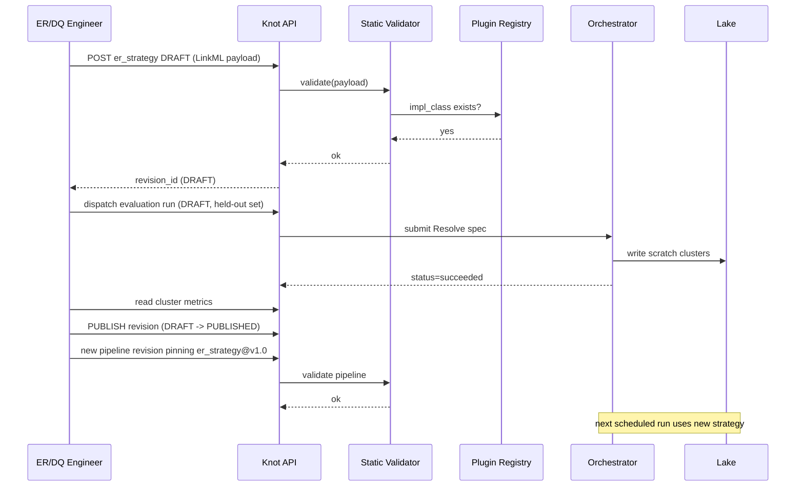
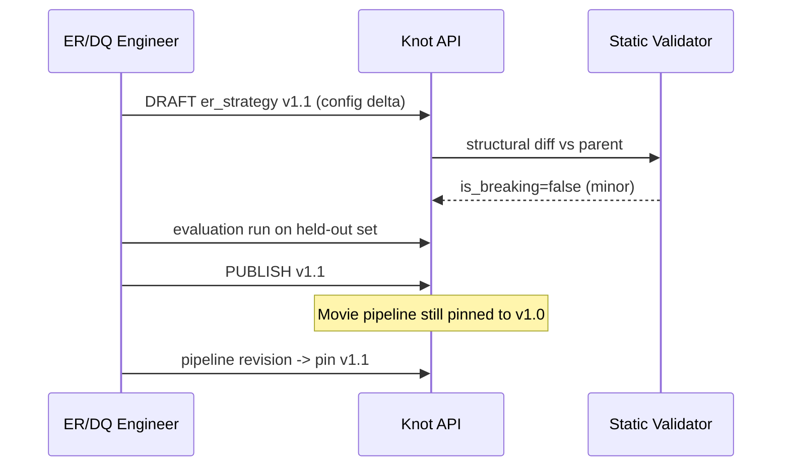

> ⚠️ **LEGACY / UNVERIFIED.** This document was authored during the prototype/exploration phase and has not been reconciled against the current codebase. Treat as historical context, not specification. Cross-check anything you intend to act on. See [`../README.md`](../README.md) for the current entry point.

# ER strategy lifecycle

This note walks the lifecycle of an ER strategy in knot from "I want a new
movie matcher" through production rollout, configuration tuning,
implementation upgrades, and shadow comparisons. It is grounded in
`knot-architecture-v1.md` and the ER/DQ Engineer persona in
`personas-and-goals.md`.

ER strategies operate at the **Resolve** stage of the six-stage pipeline
(Ingest -> Normalize -> Resolve -> Merge -> Validate -> Publish). They are
the only Resolve-stage variability axis in v1 and they participate in the
same uniform protocol+plugin pattern as `Orchestrator`, `IdentityProvider`,
`AuthorizationService`, and `QueryTranslator`.

## Configuration vs implementation

The single most important property of an ER strategy is that it has two
layers, governed by two completely different change mechanisms:

| Layer | What it is | Lives in | Versioned how | Who edits |
|---|---|---|---|---|
| **Configuration** | Parameters: blocking key shape, similarity thresholds, candidate fan-out, which `ERStrategy` implementation to invoke, weights, deterministic-rule lists | `ontology_nodes` row with `kind='er_strategy'` + LinkML payload in `ontology_node_revisions` | `vMAJOR.MINOR` revisions, append-only, structural diff classifies breaking | ER/DQ Engineer via the ontology API (UI + REST), no deployment |
| **Implementation** | Python code conforming to the `ERStrategy` protocol — `match`, `merge`, `emit` | In-tree default impls (exact match, deterministic block-then-match, ...) and deployer plugins discovered via the DJ-style ABC + env var + `__subclasses__()` pattern | Source-control + deployer release cadence | Platform engineer (release) — plugin author (code) |

Both layers move forward independently. A configuration revision **names**
the implementation it expects (e.g. `impl_class: 'DeterministicBlockMatch'`)
and pre-flight validation (`Plugin satisfiability` check) refuses to dispatch
a Resolve stage whose strategy revision references an `impl_class` that the
deployer's plugin registry does not currently expose. That static check is
what makes the two layers safely decoupled — config can never out-run code in
a way that detonates at runtime.

Pipelines reference an ER strategy revision the same way any node refers to
another node: a typed lineage edge. Each pipeline pins **one canonical ER
strategy revision** at a time (whether multiple-strategies-in-flight is
supported in v1 is flagged below).

## New ER strategy defined

Scenario: ship a new Movie ER strategy that uses normalized title + release
year as the blocking key, then a Jaro-Winkler title compare with a 0.92
threshold inside each block.

**Pre-state.** The Movie pipeline currently pins ER strategy revision
`movie_er@v1.3` (exact match on canonical id where present, fallback to
exact-title block). The deployer's plugin registry exposes
`ExactMatch`, `DeterministicBlockMatch`, and (newly merged) the
`NormalizedTitleYearBlockMatch` impl class, which has been released in the
latest knot core build.

**Actor.** ER/DQ Engineer (persona 4). Their goal verbatim: "improve match
quality without breaking downstream consumers."

**Trigger.** An evaluation problem statement, not a publish request:
duplicate-rate audit on Movies showed two clusters per real movie when the
canonical id is missing in one source. Engineer has held-out labelled
clusters from the catalog steward and wants to beat current precision/recall.

**Steps.**

1. (If needed) Platform engineer publishes a knot release that includes the
   `NormalizedTitleYearBlockMatch` class as an in-tree implementation, or
   the deployer-side plugin repo registers it.
2. ER/DQ Engineer creates a **DRAFT** revision of a new
   `kind='er_strategy'` node `movie_er_title_year` via the ontology API.
   The LinkML payload captures: `impl_class: NormalizedTitleYearBlockMatch`,
   `block_key: [normalize(title), year]`, `match_fn: jaro_winkler`,
   `match_threshold: 0.92`, `tie_breaker: highest_trust_source`.
3. Static validator runs: payload is a valid LinkML instance; `impl_class`
   is present in the deployer's plugin registry; declared block_key columns
   exist on the Movie ontology node's normalized shape; thresholds are in
   range.
4. Engineer dispatches an **evaluation pipeline** — an ad-hoc Resolve run
   parameterized with this DRAFT strategy against held-out labelled
   clusters. Output goes to a scratch lake namespace (no version pointer
   flip). Run is tracked in `runs` like any other pipeline.
5. Engineer compares cluster-level metrics (precision, recall, cluster size
   distribution, count drift vs `movie_er@v1.3`).
6. If metrics pass acceptance, engineer **publishes** the revision: DRAFT
   -> PUBLISHED. The umbrella node's `current_version` advances, a row
   appears in `history` (entity_type='ontology_node', activity_type='updated').
7. Pipeline owner submits a new revision of the Movie pipeline whose
   Resolve stage references `movie_er_title_year@v1.0` (instead of
   `movie_er@v1.3`). This is itself a versioned ontology_node change for
   `kind='pipeline'`.
8. Static validator re-runs against the pipeline spec; on pass, the next
   scheduled run uses the new strategy.

**Post-state.** New PUBLISHED `er_strategy` revision exists. Movie pipeline
points to it. Next Resolve stage produces clusters carrying that revision id
in their lineage (see "Cluster lineage and backfill" below). Old strategy
revision remains in `ontology_node_revisions` permanently — append-only.

**Failure modes.**

- **Cluster count drift.** New strategy collapses 2.1M clusters to 1.7M (over-merging) or expands them to 2.6M (under-merging). Validate stage's statistical DQ checks should flag percent-change-vs-prior-publish above a threshold; if those checks aren't authored, drift is invisible until a downstream consumer notices.
- **Plugin not deployed.** Pipeline references an `impl_class` the prod deployer's plugin registry does not export. Caught at static pre-flight — Plugin satisfiability check.
- **Schema drift.** Block-key column referenced in config no longer exists on the Movie normalized shape. Caught at static validation.
- **Threshold pathology.** 0.92 looks great on the labelled set but fan-out blows up on the long tail of foreign-title transliterations. Surfaces as Resolve-stage runtime cost spike, not a static error.
- **Trust assumption violation.** Strategy assumes `tie_breaker=highest_trust_source` but a source's trust score has decayed below another tied source — clusters churn between runs even with no input change. Idempotency violation (one of the four cross-cutting goals).

## ER strategy changed

Three change shapes; each has a different blast radius.

### Config-only (e.g. threshold tuning)

Engineer drops the match threshold from 0.92 to 0.90.

- **Pre-state.** `movie_er_title_year@v1.0` PUBLISHED, in production.
- **Actor.** ER/DQ Engineer.
- **Trigger.** Recall audit on labelled set shows misses on franchise titles with punctuation differences.
- **Steps.**
  1. Author DRAFT revision `v1.1` with the new threshold. Structural diff against parent revision is purely a slot value change -> `is_breaking=false` -> minor bump.
  2. Static validator runs; passes (same `impl_class`, same block key).
  3. Evaluation run on held-out set + recent prod sample.
  4. Publish `v1.1`. `current_version` advances on the umbrella.
  5. Movie pipeline can either (a) keep its pin on `v1.0` (the stable behavior), or (b) author a new pipeline revision pinning `v1.1`. **It does not auto-upgrade** (see backfill section).
- **Post-state.** Both revisions exist; pipeline still on `v1.0` until explicitly migrated.
- **Failure modes.** Most loosened thresholds over-merge — same cluster-count-drift detector applies. Lowered threshold + sparse sources can tip a cluster across a tie-break boundary in a way that flips the resolved value, surfacing as silent value churn in the per-source -> resolved layer.

### Implementation-only (new ABC subclass)

A new `EmbeddingBlockMatch` impl class lands in the plugin registry. Engineer wants to use it without changing any blocking-key parameters from the existing config.

- **Pre-state.** `movie_er_title_year@v1.1` in prod with `impl_class=NormalizedTitleYearBlockMatch`.
- **Actor.** ER/DQ Engineer (with platform engineer for the deployer release).
- **Trigger.** Plugin author publishes the new impl in the deployer's knot fork; integration tests pass; product wants to evaluate.
- **Steps.**
  1. Author a *new* `er_strategy` node revision (typically a new umbrella node, e.g. `movie_er_embedding`) referencing `impl_class=EmbeddingBlockMatch` plus its parameters (embedding model id, kNN k, threshold).
  2. Validator confirms the impl class exists in this deployer's plugin registry. (In other deployers without the plugin, this revision could be authored but never dispatched — Plugin satisfiability would reject pipeline runs.)
  3. Evaluation pipeline run, compare to `movie_er_title_year@v1.1`.
  4. Promote by pinning Movie pipeline at the new strategy.
- **Post-state.** Movie pipeline now references the embedding strategy revision.
- **Failure modes.** Implementation contract drift — new impl emits clusters with a slightly different shape (e.g. cluster-id derivation changed), breaking downstream consumers' assumptions. Mitigation: `ERStrategy.emit() -> dataset` protocol enforces the cluster output shape; deviations should be caught by the protocol contract + Validate stage. Cost regressions (embedding compute) surface as runtime cost.

### Both (new impl + new params together)

Standard new-strategy path from "New ER strategy defined" — there is no special workflow. Author the revision, validate, evaluate, publish, pin.

## Shadow / A-B runs

The persona doc explicitly names this workflow: ER/DQ Engineer "deploys as
a versioned `er_strategy` ... runs side-by-side, evaluates against held-out
clusters." So the *capability* is a stated requirement.

**What v1 architecturally supports out of the box.** The architecture as
written cleanly supports the ad-hoc evaluation run pattern used in steps 4
and step 3 above:

- Author a DRAFT `er_strategy` revision.
- Dispatch a one-off Resolve-stage run parameterized with that revision, writing to a scratch namespace.
- Compare lake outputs to the production resolved layer.

This is "shadow" in the sense of "run the candidate against the same input,
inspect outputs, decide." It does not require any new core machinery beyond
what exists for any pipeline run.

**What is genuinely an open question for v1.** The locked-decision summary
in the task says: "each pipeline references one canonical ER strategy
revision (open question whether multiple-strategies-in-flight is supported
in v1; assume one canonical for now)." The architecture document agrees —
nothing in the schema (`ontology_nodes`, `ontology_node_revisions`,
sketched `node_dependencies`) supports a pipeline that references **two**
ER strategies and emits both resolved layers in one run.

Concretely, the things v1 does **not** prescribe are:

- A "shadow strategy" slot on a pipeline revision that names a second `er_strategy` to run alongside the canonical one in the same scheduled run.
- Cluster-level diff dashboards that join the two output namespaces and show drift.
- Promotion gating that requires N evaluation runs of an ER strategy to pass before allowing pipeline pins.

**Proposed default for v1.** Treat shadow runs as a *manual evaluation
pipeline*, not a pipeline-level feature:

1. Engineer authors a sibling pipeline revision `movie_pipeline_shadow` that pins the candidate strategy and writes outputs to a scratch namespace (different lake target).
2. Both pipelines run on the same schedule. Inputs are deterministic (idempotency goal), so outputs are directly comparable.
3. Engineer joins the two scratch outputs in SQL and inspects.
4. Once acceptable, the shadow pipeline is deleted; the production pipeline revision is updated to pin the candidate.

That avoids burning v1 effort on a multi-strategy-per-pipeline feature
while delivering exactly the workflow the persona needs. Promote
pipeline-level shadow support to a v2 design item if the manual flow
becomes painful at scale.

## Cluster lineage and backfill

### Lineage: which strategy revision produced which cluster

Two complementary mechanisms in the architecture combine to answer "which
ER strategy version produced this cluster":

1. **Table-level lineage (postgres `node_dependencies`).** A pipeline revision is itself an `ontology_node_revisions` row whose payload references the `er_strategy` revision id it pins. So for any pipeline run, its `spec_hash` deterministically identifies the strategy revision via the pipeline revision payload.
2. **Per-property / per-relation provenance (lake provenance columns).** The architecture states every materialized fact carries source columns including `materialized_at`, `source_id`, `correction_id`, `trust_at_materialization`. For Resolve-stage outputs, the natural extension of this pattern is to write the producing **er_strategy_revision_id** onto each cluster row in the per-source layer (or, more cheaply, onto the cluster header in a clusters table the per-source layer joins to).

Combined: from any cluster on the lake, follow the `er_strategy_revision_id`
column to `ontology_node_revisions.id`, fetch `payload`, and you have the
exact LinkML config; from there follow `payload.impl_class` and you have the
code. This is the lineage win the ER/DQ persona's "Knot win" line names by name.

The `runs` and `run_events` tables already hold `node_id` (the pipeline) and
`spec_hash`, so the run-level audit trail is in place; per-cluster lineage
just needs the column on the lake row.

**Suggested concrete addition** (sketch — flag for the materialization-compiler / lake-schema design item, not a locked decision): the per-source cluster layer carries an `er_strategy_revision_id UUID` column populated by the Resolve stage. The Resolved layer inherits it via the same window-function path that resolves other properties.

### Backfill: do existing pipelines re-run automatically?

This is one of the **Open design items** in the architecture (item 1:
"Lineage propagation policy on ontology change"). The architecture
explicitly leaves it open. Here is the proposal for the ER-strategy slice
of that question.

**Proposed default: opt-in promotion, not auto-rebuild.**

When an `er_strategy` revision is published:

- Existing pipelines keep their pinned revision. Nothing rebuilds automatically. The next run with no pipeline change uses the same strategy revision as the last run.
- Knot writes a `history` row noting "downstream pipeline X is now N revisions behind on its ER strategy pin" so the UI can surface a soft "upgrade available" badge to the pipeline owner.
- Pipeline owners promote by authoring a new pipeline revision that pins the new strategy revision.

**Why this default.**

- **Determinism.** "Same inputs + same versions always produce same outputs" is one of the four cross-cutting goals. Auto-rebuild on strategy publish breaks that — yesterday's run and tomorrow's run on the same inputs would diverge silently.
- **Blast radius control.** ER strategies are specifically the subsystem the persona doc warns "improve match quality without breaking downstream consumers." Auto-rebuild moves the blast-radius decision out of the pipeline owner's hands.
- **DJ pattern alignment.** DJ's revision/availability model is pin-based; auto-propagation is not the norm.
- **Reversibility.** A bad ER strategy revision should not invalidate every downstream materialization at the moment of publish — it should require an explicit pin step that can be reverted by another pin.

**What auto-rebuild *would* look like, if a deployer wanted it.**
A single boolean on the pipeline ontology node (`auto_upgrade_er_strategy:
bool`) plus a knot-internal scheduler that, on `er_strategy` publish,
emits a new pipeline revision pinning the new strategy. Defer to v2.

**Failure modes that make auto-rebuild dangerous in v1.**

- Strategy `v1.2` over-merges -> resolved layer changes silently for every Movie pipeline that auto-upgraded -> downstream ML model retrains on contradictory clusters.
- Two strategies published close in time race; pipeline owner can't tell which one a given run used without reading run timestamps.
- Pipeline operators (persona 6) lose the "I know exactly what changed since the last run" property they rely on for triage.

## Open questions

- **Multiple-strategies-in-flight per pipeline.** Locked as "one canonical for v1." Re-evaluate if shadow runs prove painful at the manual-evaluation level. (Proposed v1: sibling shadow pipelines, manual diff.)
- **`er_strategy_revision_id` on cluster rows.** Strongly implied by the architecture's per-fact provenance pattern, but the exact lake column placement (per-source layer vs separate clusters table) is a materialization-compiler design call.
- **Backfill / lineage propagation policy.** The umbrella open item from the architecture; ER-strategy slice proposed here as opt-in pin-based promotion.
- **Evaluation pipeline as a first-class concept.** Today it's "an ad-hoc run with a DRAFT revision." Whether knot needs an explicit `kind='evaluation'` or `kind='er_strategy_evaluation'` node to formalize held-out-set tracking, metric capture, and pass/fail gating is open. v1 default: ad-hoc run + manual metrics.
- **Promotion gating.** Should a pipeline pin to a PUBLISHED `er_strategy` revision require a passing evaluation-run record? v1 default: no — promotion is policy, not enforced.
- **Strategy revision immutability vs. impl_class evolution.** What happens if a deployer ships a knot release that removes an impl_class still referenced by a PUBLISHED er_strategy revision? Plugin satisfiability would start failing for any pipeline pinning that revision. Either the plugin must be retained for the lifetime of any revision that names it (deployer policy), or the er_strategy revision must be re-pinned (pipeline owner action). Flag for the plugin-deprecation policy design.
