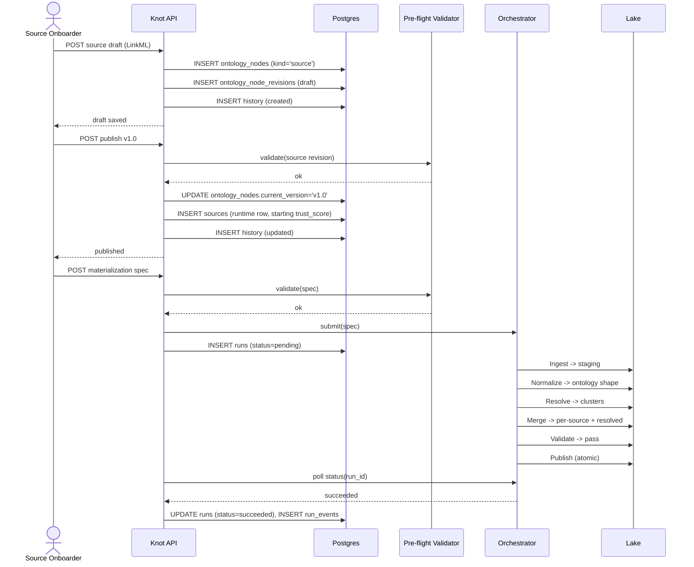

> ⚠️ **LEGACY / UNVERIFIED.** This document was authored during the prototype/exploration phase and has not been reconciled against the current codebase. Treat as historical context, not specification. Cross-check anything you intend to act on. See [`../README.md`](../README.md) for the current entry point.


# Source lifecycle

This note walks the source lifecycle in knot end-to-end, grounded in
`knot-architecture-v1.md`. Two flows are covered: onboarding a brand
new source (IMDB), and changing an existing source (config tweak vs
shape-breaking v2). It also sketches how a source's `trust_score`
moves over its lifetime.

Two facts to keep in mind throughout:

- A source is an `ontology_nodes` row with `kind='source'`. Its
  *definition* (LinkML instance: connection info, ontology mapping,
  refresh policy) lives as a JSONB payload in
  `ontology_node_revisions`, just like any other node. Versioning is
  `vMAJOR.MINOR`, `is_breaking` is computed from a structural diff.
- A source's *runtime state* (current `trust_score`, last-refresh
  timestamp, etc.) lives in the `sources` runtime table, 1:1 with
  the ontology node id. Watermarks per stage live in `watermarks`.

The six pipeline stages are: **Ingest → Normalize → Resolve → Merge →
Validate → Publish**. Source onboarding is fundamentally "stand up an
Ingest stage for the new source and let it feed the existing
downstream stages."

## New source added

End-to-end walkthrough: "I want to onboard IMDB" → "IMDB rows are in
the resolved layer in the lake."

### Pre-state

- IMDB is not registered. No `ontology_nodes` row with `name='IMDB'`
  exists.
- Downstream data nodes (e.g. `Movie`, `CastMembership`) already
  exist as `kind='data'` nodes with a published LinkML schema.
- Lake has per-source + resolved layers for those data nodes,
  populated from whatever sources are already onboarded.
- Postgres `sources` table has no row for IMDB. No `watermarks` rows
  for an IMDB ingest stage.

### Actor

**Source Onboarder** (persona 2 from `personas-and-goals.md`). Data
engineer integrating an upstream feed.

Secondary actors observing the run: **Pipeline Operator** (persona 6)
watching the run dashboard for the first IMDB Ingest run; **Ontology
Author** (persona 1) is the gatekeeper if IMDB introduces fields that
require a `Movie` schema extension.

### Trigger

Source Onboarder initiates: "we have approval to consume IMDB; get it
into the graph." They open the knot UI / CLI and start authoring a
new source node.

### Steps

1. **Author source DRAFT.** Onboarder writes a LinkML instance
   describing the IMDB source: connection info (endpoint, auth
   handle), ontology mapping (which IMDB fields map to which slots
   on which `kind='data'` nodes), refresh policy.
   → Knot's response: `POST` to the ontology API creates an
   `ontology_nodes` row with `name='IMDB'`, `kind='source'`,
   `current_version=NULL`, and writes the first revision into
   `ontology_node_revisions` as a draft. `is_breaking` is computed
   but moot for v0. `history` records `entity_type='ontology_node'`,
   `activity_type='created'`.
   → State change: source node exists in postgres as a draft.
   `current_version` is still `NULL` (umbrella row points nowhere
   yet — drafts can be invalid; no published revision exists).

2. **Iterate the draft.** Onboarder edits mapping, fixes typos,
   re-saves. Each save is a new revision row (or, if the canonical
   payload hash matches an existing revision, returns that revision
   — content-hash dedup).
   → Knot's response: each save runs LinkML/SHACL validation on
   the payload itself (is the source LinkML instance well-formed?)
   but does *not* yet run the full pre-flight validator — drafts
   are allowed to be invalid in the DJ sense.

3. **Publish the source.** Onboarder hits "publish v1.0".
   → Knot's response: runs the **static pre-flight validator** on
   the draft. For a source, this means: ontology mapping references
   real slots on real published data nodes (DAG completeness,
   ontology conformance); declared types align (LinkML ↔ projected
   types); auth says the caller can publish a `kind='source'` node;
   plugin satisfiability is trivial (no ER plugin reference yet).
   On pass, `ontology_nodes.current_version` is flipped to `v1.0`,
   pointing at this revision via the composite FK
   `(current_version, id) → (version, node_id)`. `history` logs
   `activity_type='updated'` with pre/post payloads.
   → State change: IMDB has a published v1.0 source definition.

4. **Initialize source runtime row.** On publish of a `kind='source'`
   node that is being published for the first time, knot inserts the
   `sources` runtime row keyed by `ontology_nodes.id`: starting
   `trust_score` (open: exact starting value isn't specified in the
   architecture — flagged in Open questions), `last_refresh=NULL`,
   any other runtime fields.
   → State change: IMDB now has both a definition (postgres
   ontology) and runtime state (postgres `sources`).

5. **Pipeline materialization.** Onboarder (or an upstream automation)
   submits the materialization spec for IMDB's Ingest stage. The
   compiler produces the SQL + Spark job spec. Pre-flight validator
   gates the spec.
   → Knot's response: validator checks SQL parses (sqlglot), types
   align with the IMDB source schema and the downstream data node's
   declared shape, no dangling references, caller is authorized,
   ER strategy and orchestrator plugins exist.
   → On pass: spec hands off to `Orchestrator.submit(spec)`; a
   `runs` row is created with `node_id` = the IMDB source node, a
   `spec_hash`, `status='pending'`, and `orchestrator_run_id`.

6. **First run executes through the pipeline.** Orchestrator dispatches
   the Spark job. Knot polls `Orchestrator.status(run_id)` and writes
   `run_events` per stage transition.
   - **Ingest:** pull raw IMDB data into lake staging tables.
     `watermarks` row updated for `(source_id=IMDB, stage='ingest')`.
   - **Normalize:** map raw fields to ontology types per the LinkML
     mapping in the source revision payload. SHACL validates each
     row against the target data node's LinkML schema.
   - **Resolve:** ER consumes IMDB-normalized records alongside other
     existing sources for the same `kind='data'` node.
   - **Merge:** trust-aware reconciliation. IMDB's starting
     `trust_score` decides which IMDB-supplied values win against
     existing sources. Per-source layer gets new IMDB rows tagged
     with `source_id=IMDB`, `trust_at_materialization=<starting>`.
   - **Validate:** SQL/statistical/freshness checks on the resolved
     layer. Hard-check failures fail the pipeline; soft checks warn.
   - **Publish:** atomic write of the per-source + resolved layers to
     the lake; revision pointer flip in postgres so consumers see
     the new revision.
   → State change: lake now contains IMDB-sourced facts in both
   per-source and resolved layers. `runs.finished_at` set;
   `runs.status='succeeded'`.

### Post-state

- `ontology_nodes`: row `name='IMDB'`, `kind='source'`,
  `current_version='v1.0'`.
- `ontology_node_revisions`: at least one published revision (more if
  the onboarder iterated as drafts before publish).
- `sources`: runtime row with a current `trust_score`, populated
  `last_refresh`.
- `watermarks`: per-stage progress markers for the IMDB Ingest stage
  (and downstream stages that consumed it).
- `runs` + `run_events`: full log of the first end-to-end run.
- Lake per-source layer: rows with `source_id=IMDB`,
  `trust_at_materialization=<starting>`, `correction_id=NULL`.
- Lake resolved layer: window-function-picked highest-trust value per
  `(entity, property)` now considers IMDB as a candidate.

### Failure modes

- **Mapping references a slot that doesn't exist on the target data
  node.** Caught at publish-time by pre-flight validator (DAG
  completeness + ontology conformance). Returned as a structured
  error record (path + check + remediation hint) so the UI can
  highlight the offending field. Source stays in DRAFT;
  `current_version` not flipped.
- **Type mismatch (IMDB string ↔ data node int).** Same path: caught
  by pre-flight validator's type compatibility check. Onboarder fixes
  in the draft and re-publishes.
- **SHACL failure during Normalize.** Per-row failures handled per
  the data node's SHACL contract (open: row-level reject vs
  pipeline-fail policy not specified in architecture). Pipeline-level
  hard failure marks the `runs` row failed; Pipeline Operator drills
  into `run_events`.
- **Connection / auth failure during Ingest.** Stage fails; runtime
  state (`last_refresh` stays at prior value); `runs.status='failed'`;
  `run_events` carries the error. No data lands in lake.
- **Pre-flight validator passes but the Spark job crashes mid-run.**
  Static validator can't catch runtime issues. Orchestrator status
  poll surfaces failure; partial writes prevented because Publish is
  atomic — earlier stages produce staging tables only, and the
  revision pointer flips only in Publish.
- **`is_breaking` mis-classified.** For a brand-new source there is
  no parent revision to diff against, so `is_breaking` is moot at
  v1.0. Becomes relevant from v1.1 onward (next section).

### Sequence diagram



## Source changed

A published source can change for four reasons covered here:
connection-string change, refresh-policy change, ontology-mapping
change, schema drift detected upstream. The first three are
intentional edits by an Onboarder; the fourth is a forced reaction.

The architectural distinction is the `is_breaking` flag, computed at
write time by structural diff over the LinkML payload:

- **Minor revision (`is_breaking=false`)** — additive or non-shape
  changes. Bumps minor: `v1.0 → v1.1`. Examples below.
- **Major revision (`is_breaking=true`)** — subtractive or
  type-changing. Bumps major: `v1.x → v2.0`. "I'm moving to IMDB v2
  with a different shape" lands here.

The doc is precise on what flips the bit: removed slots, type
changes, required-ness changes, narrowing enums → major. New optional
slots, new classes, annotations → minor. Knot computes this; the
human doesn't pick it.

### Pre-state

- IMDB exists. `ontology_nodes.current_version='v1.0'` (or `v1.x`).
- `sources` row holds an evolved `trust_score` (see trust section
  below) and a recent `last_refresh`.
- Lake per-source + resolved layers contain IMDB-sourced facts
  tagged with the prior revision's mapping behavior.

### Actor

- Connection string / refresh policy / ontology-mapping edits:
  **Source Onboarder**.
- Upstream schema drift detection (a Validate-stage check fires, or
  the Ingest stage starts producing rows that fail Normalize SHACL):
  detected by **Pipeline Operator** in the run dashboard, escalated
  to **Source Onboarder** (and **Ontology Author** if the data node
  schema needs changes too).

### Trigger

One of:

- **Connection string change.** Vendor rotated credentials; auth
  endpoint moved. Onboarder edits the connection-info section of the
  source LinkML.
- **Refresh-policy change.** Move from daily to hourly; change a
  watermark-mode field. Onboarder edits the refresh-policy section.
- **Ontology-mapping change (additive).** IMDB now exposes a new
  field that maps cleanly to an existing slot, or to a new optional
  slot the Ontology Author just added on the target data node.
- **Schema drift detected upstream.** IMDB v2 changed shape:
  renamed a field, dropped one, retyped another. Normalize starts
  rejecting rows under the v1 mapping; Pipeline Operator sees the
  failed run.

### Steps — minor revision (config tweak / additive mapping)

1. **Edit source as DRAFT.** Onboarder opens the source node, edits
   the LinkML payload (new connection string, or new refresh cadence,
   or one new optional mapping line).
   → Knot's response: a new draft revision is written to
   `ontology_node_revisions` with `parent_revision_id` pointing at
   v1.0. Content hash differs, so a new row is created.

2. **Compute `is_breaking`.** Knot diffs the new payload against the
   parent revision structurally. None of the changes are
   subtractive/type-changing → `is_breaking=false`. Proposed version:
   `v1.1`.

3. **Publish v1.1.** Onboarder publishes.
   → Knot's response: pre-flight validator runs (same checks as
   onboarding-step-3 above). On pass, `ontology_nodes.current_version`
   flips to `v1.1`. `history` logs the update with pre/post payloads.
   `sources` runtime row is **not** reset — `trust_score`,
   `last_refresh` persist across minor revisions (the *definition*
   changed, the *source identity* did not).

4. **Next pipeline run picks up the change.** Refresh-policy or
   connection-string changes affect Ingest configuration on the next
   triggered run. Mapping additions affect Normalize on the next
   triggered run.
   → State change: lake gets new per-source rows under the v1.1
   mapping; the new rows carry `trust_at_materialization` from the
   evolving `trust_score`.

### Steps — major revision (IMDB v2, different shape)

1. **Edit source as DRAFT.** Onboarder rewrites the mapping for the
   new IMDB shape. Some old slots disappear; types change; new
   required fields appear.

2. **Compute `is_breaking`.** Structural diff finds subtractive /
   type-changing deltas → `is_breaking=true`. Proposed version:
   `v2.0`.

3. **Publish v2.0.** Pre-flight validator must pass exactly as for
   any other publish — type compatibility, ontology conformance,
   DAG completeness. The breaking flag does **not** weaken the
   validator: a major revision still has to be a valid spec.

4. **Downstream impact resolution.** This intersects open design item
   #1 in the architecture doc: "Lineage propagation policy on
   ontology change." Options enumerated there are mark stale,
   auto-invalidate, auto-rebuild, or block downstream reads until
   rebuild. **Open** — not yet decided. Whichever policy lands is
   what fires here.
   → State change: data nodes consuming IMDB have to re-materialize
   under the new mapping. Trust score continuation across a major
   revision is also **open** — see open questions.

5. **Schema-drift-driven major.** If the trigger was upstream drift
   (not a planned migration), the path is the same: Onboarder
   authors a v2.0 draft against the new IMDB shape, validator
   gates, publish flips current_version. The difference is
   operational urgency: the prior pipeline is failing, so Pipeline
   Operator wants the new revision out fast. Drafts let the work
   happen without breaking the published pipeline definition until
   the new mapping is ready.

### Post-state (either path)

- `ontology_node_revisions`: new revision row appended; old
  revisions preserved (append-only).
- `ontology_nodes.current_version`: bumped to v1.1 or v2.0.
- `sources` runtime row: persists across the change for minor
  revisions; behavior across major revisions is **open**.
- Lake: new rows reflect the new mapping on the next run;
  pre-change rows in the per-source layer are preserved (provenance
  carries `trust_at_materialization` and source revision context;
  lake provenance fidelity across breaking source revisions is
  **open** — the architecture specifies `source_id` on per-source
  rows but does not specify whether source-revision id is also
  carried).

### Failure modes

- **Mapping no longer references a real slot** (e.g. data node
  schema changed underneath). Validator catches at publish-time;
  publish blocked; draft preserved.
- **Type drift** (IMDB v2 sends int where v1 sent string). Validator
  catches if the mapping declares the wrong projected type;
  Normalize/SHACL catches at runtime if validator was satisfied
  but real rows violate constraints.
- **Operator publishes a major revision without coordinating
  downstream rebuild.** Outcome depends on lineage propagation
  policy (open item #1). Conservative default in spirit of the
  architecture would be "mark stale" rather than auto-invalidate
  consumers.
- **Schema drift is silent** (IMDB changes shape but Normalize still
  accepts rows because the old mapping projects through). Caught
  by post-resolution Validate-stage SQL checks (statistical /
  freshness / cross-entity invariants) — soft checks warn, hard
  checks fail the pipeline. This is exactly what stage 5 is for.
- **Onboarder mis-edits and creates a draft that won't validate.**
  Drafts are allowed to be invalid (DJ semantics). The published
  v1.x stays the current version; the broken draft sits as an
  unpublished revision until fixed.

### Sequence diagram

```mermaid
sequenceDiagram
    actor Onboarder as Source Onboarder
    participant API as Knot API
    participant Diff as Structural Diff
    participant Val as Pre-flight Validator
    participant PG as Postgres
    participant Orch as Orchestrator

    Onboarder->>API: PATCH source (draft edit)
    API->>PG: INSERT ontology_node_revisions (draft, parent=v1.0)

    Onboarder->>API: POST publish
    API->>Diff: diff(parent_payload, new_payload)
    alt additive only
        Diff-->>API: is_breaking=false, version=v1.1
    else subtractive / type change
        Diff-->>API: is_breaking=true, version=v2.0
    end
    API->>Val: validate(new revision)
    alt validator passes
        Val-->>API: ok
        API->>PG: UPDATE ontology_nodes.current_version
        API->>PG: INSERT history (updated, pre/post)
        API-->>Onboarder: published
        Onboarder->>API: POST materialization spec (next run)
        API->>Orch: submit(spec)
        Orch-->>API: run completes; lake updated under new mapping
    else validator fails
        Val-->>API: errors (path + check + hint)
        API-->>Onboarder: publish blocked; draft retained
    end
```

## Trust score evolution (during a source's life)

Trust score is knot-owned and lives in postgres in the `sources`
runtime table (1:1 with the `kind='source'` ontology node). The
algorithm itself is open design item #4 — decay rate, per-property
vs per-source granularity, weighting, and how a contradicting
correction translates to a delta are all unspecified.

What the architecture *does* lock:

- **Starting trust** — a value exists when the runtime row is
  inserted at first publish. Concrete value is **open**.
- **Lose on contradiction** — when a Data Steward submits a
  correction that overrides a value sourced from this source, this
  source loses trust. The correction carries
  `overridden_source_id`, which is the hook the algorithm uses.
- **Gain on no-contradiction over time** — sources gain trust when
  they are not contradicted. Decay/recovery rate is open.
- **Corrections-source has fixed/configurable high trust** — by
  design it sits at the top of the trust ordering so its values
  win at Merge time.
- **Trust at materialization is captured** — every per-source row
  in the lake records `trust_at_materialization`, so historic Merge
  decisions can be reconstructed even after the live trust_score
  moves.

Lifecycle picture, qualitatively:

1. **Newly onboarded.** IMDB published; runtime row created;
   `trust_score` at the starting value.
2. **First runs.** IMDB rows hit the lake at
   `trust_at_materialization=<starting>`. Some win at Merge, some
   lose to higher-trust sources or to corrections.
3. **Corrections accumulate.** Stewards correct individual values.
   Each correction with `overridden_source_id=IMDB` nudges IMDB's
   trust down (per the open algorithm).
4. **Quiet periods.** No contradictions → trust drifts upward
   (per the open recovery rule).
5. **Source change.** Minor revision: trust persists. Major revision:
   continuation policy is **open**.
6. **Source archived.** `ontology_nodes.archived_at` set on the
   umbrella row (soft-delete at umbrella only — revisions never
   deleted). Whether the runtime `sources` row is removed,
   tombstoned, or kept for audit is **open**.

## Open questions

These are gaps the architecture doc explicitly leaves open or that
this walkthrough surfaced.

1. **Starting `trust_score` value** for a newly published source.
   Architecture says trust scoring exists; doesn't pin the initial
   number.
2. **Per-property vs per-source trust granularity.** Listed as
   open design item #4. Affects the lifecycle: a per-property model
   means trust evolves independently for each `(source, slot)`.
3. **Trust-score continuation across major revisions.** Does
   `v1.x → v2.0` reset, carry over, or scale? Not specified.
4. **Lineage propagation policy on source schema change.** Open
   design item #1. Determines what happens to downstream data
   nodes when IMDB publishes a breaking revision.
5. **Source-revision id on per-source lake rows.** Lake schema
   pattern documents `source_id`, `materialized_at`,
   `correction_id`, `trust_at_materialization` — does it also
   carry the source's `revision_id` for full provenance across
   breaking source revisions? Not specified.
6. **SHACL failure handling at Normalize.** Row-level reject vs
   stage-level fail policy isn't pinned in the architecture doc.
7. **Soft-delete semantics for the `sources` runtime row.** When a
   source's umbrella `archived_at` is set, does the runtime row
   get cleared, tombstoned, or kept? Not specified.
8. **Auto-trigger of Ingest after a minor source publish.** Does
   publishing a refresh-policy change automatically reschedule the
   next run, or does the Onboarder need to explicitly submit a
   spec? The architecture defines the trigger API but not the
   implicit-trigger policy on source revisions.
