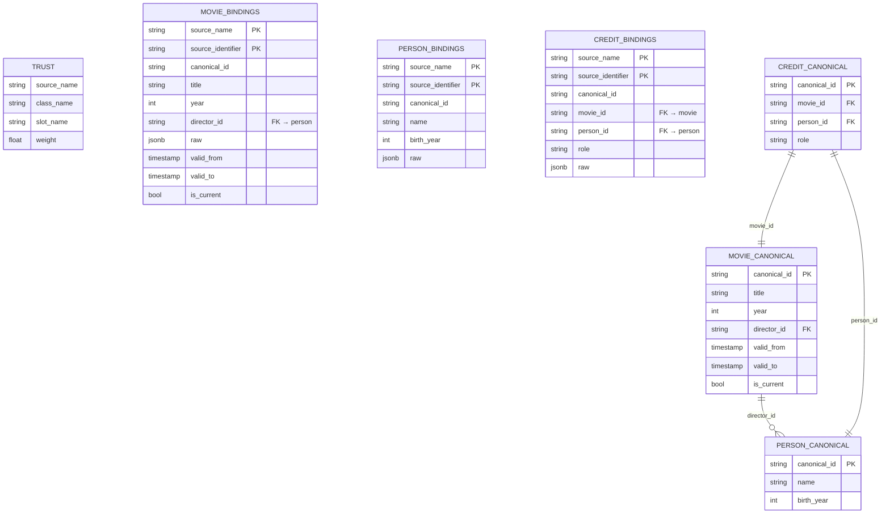
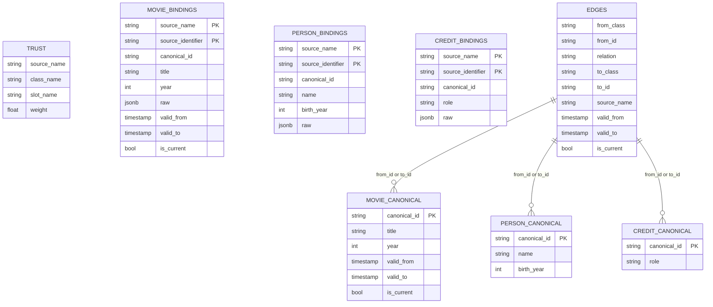

# Postgres Graph Modeling: Two Designs

Two approaches to modeling a multi-source entity graph in postgres. Both share ~90% of the structure; they differ only in where relationships live.

---

## Shared Structure (both designs)

**Per entity class and per reified relation, two tables:**

| Table | Purpose |
|---|---|
| `<class>_bindings` | All sources' claims, normalized into typed slots + a `raw` jsonb column. One row per `(source_name, source_identifier)`. |
| `<class>_canonical` | Post-matching, post-truth-resolution canonical version. One row per `canonical_id`. |

**Shared global tables:**

| Table | Purpose |
|---|---|
| `trust` | Per-`(source, class, slot)` weight values. Updated by batch truth discovery at some cadence (days). |

**Storage characteristics:**

- All tables are **append-only**, with `valid_from`, `valid_to`, `is_current` columns
- Postgres retains a rolling window of history (days), then **purges** older rows
- Downstream of postgres: CDC stream → Iceberg (merge-on-read, daily compaction) OR daily batch mirror Postgres → Iceberg
- Additionally: a **flattened view** projected into Iceberg for direct warehouse consumption

---

## Design A — FK on class tables

Foreign keys live as **columns on the entity tables themselves**. Relationships are inline.

### Diagram

### Pros

- **Native postgres FK enforcement** — referential integrity at write time, not enforced separately
- **Query planner sees the join** — typed indexes on FK columns, plan inlines the join, fast traversal
- **Schema documents the relationships** — looking at `credit_canonical` tells you it points at Movie and Person
- **Per-class evolution** — adding a slot or FK to one entity doesn't touch other tables
- **Smaller working set per query** — joins only touch the two relevant tables

### Cons

- **Schema changes for new relations** — adding `movie.producer_id` requires `ALTER TABLE` on the canonical + bindings tables (and a migration)
- **Many-to-many still needs reified relation tables** (Credit) — you don't escape bridge tables, you just have one per relation type
- **Per-source FK disagreement is messy** — bindings hold pre-ER source-ids that don't match any canonical_id until ER stamps them

---

## Design B — Universal bridge table

Same per-class tables as A, but **no FK columns**. Instead, one **universal edges table** holds every relationship in the graph.

### Diagram

### Pros

- **Add relations without schema migrations** — new edge type? insert into `edges`. No DDL.
- **Polymorphic queries** — "find all relations from this entity" is one query against `edges`, not a UNION across N tables
- **Edge metadata is uniform** — provenance, valid_from/to, weight all live in one place with one shape
- **Reified relations are automatic** — Credit (Movie + Person + role) is just two edge rows plus a Credit canonical record
- **Closer to a graph DB shape** — easier to project into Neo4j or SQL/PGQ later

### Cons

- **No native FK enforcement on edges** — `from_id` / `to_id` can't FK to specific tables (postgres FKs are typed to one table). Enforce via constraint triggers or app code.
- **All graph queries hit one mega-table** — `edges` becomes the hottest table. Needs aggressive partitioning (by `from_class`, or by `from_id` hash).
- **Joins are slower** — every relationship traversal joins through `edges` instead of a direct FK. Planner can't push down typed indexes as effectively.
- **Loss of type information in DDL** — schema doesn't tell you "Credit points at Movie"; that's runtime or config knowledge.
- **Per-source edge disagreement** — same FK problem as A, but now spread across `edges` rows with a `source_name` discriminator, so you need argmax-style resolution on edges too.

---

## The Tradeoff

**A optimizes for query performance and integrity.** Native FKs, typed indexes, schema-as-documentation. Best when the relation set is known and stable.

**B optimizes for schema flexibility and polymorphic traversal.** No DDL to add edge types, uniform edge metadata, graph-like access patterns. Best when relations are open-ended or the system needs to evolve relations without migrations.

Production systems often start at **A** and add a **B-shape layer** (an `edges` view or materialized table) when polymorphic graph queries become common. Netflix's RDF-style approach is conceptually closer to B (triples are universal edges). Knot's current model is closer to A (FK columns on bindings).

---

## Verdict for a Shallow-Traversal Workload

Assume the expected workload: most queries hit a **single node**, occasionally 1–2 hops, rarely 3, almost never 4. **Choose Design A.**

- **Design A (FK on class tables)** — at 1–3 hop depth with selective queries, postgres's native FK columns plus typed indexes are unbeatable; the planner inlines the join, hits the right index, and returns in single-digit milliseconds.
- The universal bridge table in B becomes the hottest table in the database and forces every traversal through one mega-join — fine for graph DBs built around that pattern, terrible when 99% of queries are 1-hop and you're paying graph-shape cost for relational-shape work.
- B's only real win (no DDL to add edge types) doesn't matter if your relation set is stable and known up front — which it is for a content KG with a typed spec; trade away theoretical flexibility you won't use for query performance you will use on every request.
