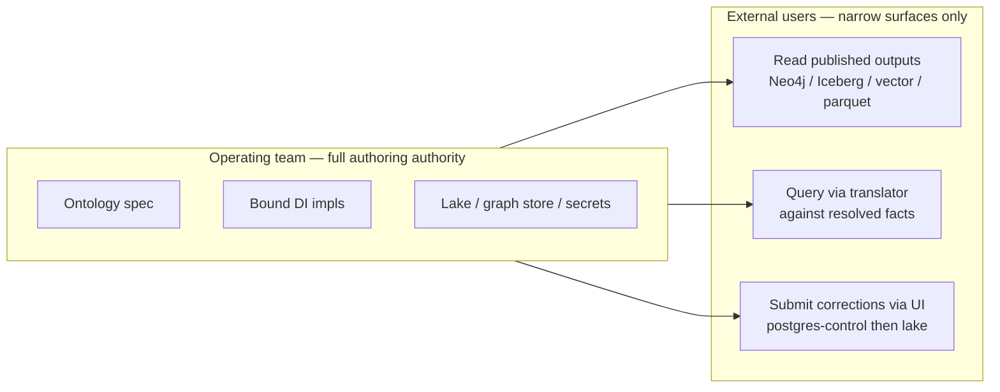
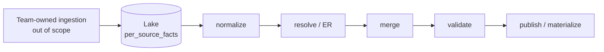
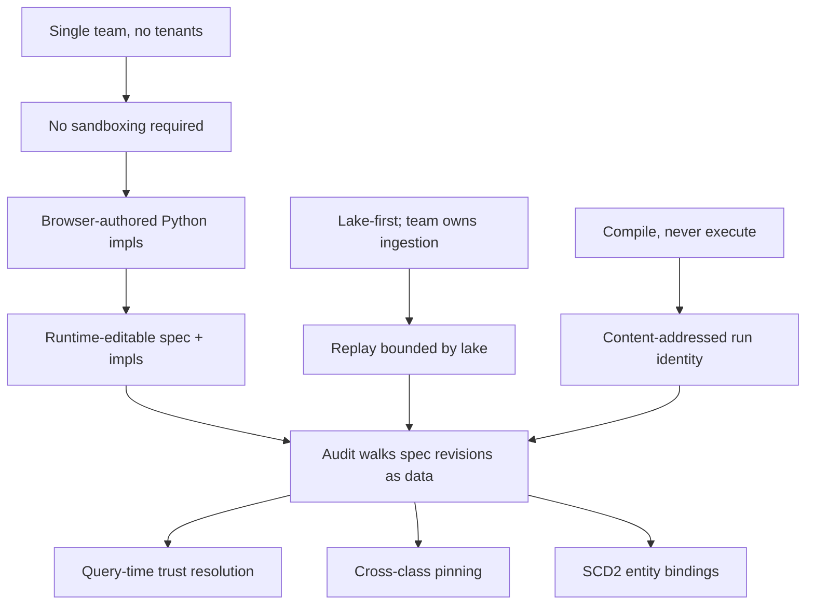

# Constraints and posture

The constraints under which knot has to work. These are not "for now" simplifications; they are deliberate choices about scope and trust that dissolve large categories of complexity. Treating any of them as fashion instead of constraint causes the design to drift back toward the systems already enumerated in [`why-existing-systems.md`](why-existing-systems.md), at which point the team is solving someone else's problem.

---

## One-paragraph summary

Knot is a tool for **one team** to manage and evolve their knowledge graph. There are no tenants, no plugin marketplace, no third-party impl distribution, and no every-team interop story. The team owns the deployment, the ontology spec, every bound dependency-injection implementation, and everything outside knot's seams that those impls touch. External users only enter at three narrow surfaces. This posture — combined with **lake-first** data residency, a **compile-not-execute** discipline, **runtime-editable** authoring, and the **audit promise** — is what makes the design space tractable. Each of these constraints rules out otherwise-attractive solutions for a reason.

---

## Constraint 1 — single team, no tenants

The team that operates knot also owns:

- The knot deployment.
- The ontology spec (authored programmatically via UI / API).
- Every bound DI impl (entity resolution, materialization, custom data-quality, query execution backends, translator).
- The infrastructure outside knot's seams that the impls touch — lake storage, graph stores, model files, secrets, message buses.

External users only enter at **three narrow surfaces**, and at none of them do they author Python or edit the spec:

### Why this is load-bearing

| Concern dissolved | What this rules out |
|---|---|
| Hostile-author scenarios | No sandboxing. No restricted Python. No formal-contract enforcement at impl boundaries. |
| Multi-tenant isolation | No per-tenant compile cache partitioning. No tenant-aware audit. No per-tenant trust spaces. |
| Plugin / marketplace versioning | No semver dance for impl interfaces. No deprecation cycles. The team writes their thing once. |
| "Every team would reinvent X" arguments | Don't apply. There is no every-team. Reinvention is judged against this team's needs, not an ecosystem's. |
| Open-ecosystem interop (RDF / SHACL export / LinkML YAML) | Not a goal unless the team chooses to publish to a specific ecosystem, and then it is a bound impl decision, not a knot deliverable. |

Trying to be a generic platform produces real complexity (sandboxing layers, restricted Python, formal-contract enforcement, version negotiation) that this team does not need. Removing those layers is what makes browser-authored impls live for the next compile possible without ceremony. See [`design/goals.md`](../../../design/goals.md) § "Who uses knot."

### What this does *not* mean

This is not "small scale." The team can run Spark + Trino on a multi-petabyte lake; the audit promise still holds. "Single team" is about *trust posture and authoring authority*, not data volume.

It also does not mean knot has no interfaces. The DI seam is precisely defined and validated. It just isn't an interface intended to be implemented by people the operating team doesn't know.

---

## Constraint 2 — lake-first; knot starts at normalize

Sources land in the lake however the team wants — whatever ingestion system, whatever credentials, whatever cadence. Knot starts at `normalize`. There is no `SourceReader` interface and no knot-managed ingestion credentials.

### Why

1. **Credentials hygiene.** Pulling from external systems means knot holds those credentials. The team already has a system for that; doubling it inside knot is reinvention.
2. **Replay reproducibility.** If knot pulled live from external systems, every replay would risk drift (TMDb's API today is not TMDb's API yesterday). With sources landing in the lake, replay is bounded by what the lake holds.
3. **Boundary clarity.** The team's responsibility ends at "land typed rows in the lake at this URI on this watermark." Everything after that is knot's problem.

This rules out pulling-from-source as a knot capability. Teams that want pull semantics build a thin upstream and land the results.

---

## Constraint 3 — compile, never execute

Knot is a compiler. It reads the spec, emits a content-addressed `WorkflowSpec`, and dispatches to whatever orchestrator the team uses (Maestro, Airflow, Argo, a toy in-memory runner). Knot polls for completion and records the run.

Knot has:

- **No internal queue.**
- **No internal scheduler.**
- **No internal SQL engine.**
- **No internal HTTP loop that touches data.**

Lake-side execution goes through bound impls of `QueryReader`, `Materializer`, `Introspector`, and `ViewManager`. Even knot's own machinery — built-in DQ checks, structural validation queries, materialized DataContext views — runs through the same QueryExecutor protocols.

### Why

| What this rules out | What this enables |
|---|---|
| Adding a "knot worker" that picks up jobs | The team's existing orchestrator is the only orchestrator. |
| Inline SQL execution in API handlers | Every data-touching operation is dispatched through one boundary. |
| Knot-specific dialect lock-in | Bound impls translate. Knot core is dialect-agnostic. |
| Knot-internal alerting / scheduling drift | Failures surface; the orchestrator (or an optional bound notifier) handles routing. |

Inverting this — putting an execution engine inside knot — collapses the seam between control plane and data plane and produces a different system. See [`design/knot-as-compiler.md`](../../../design/knot-as-compiler.md).

---

## Constraint 4 — runtime-editable, programmatic authoring (knot is reflective)

The ontology spec is authored via UI and API over a typed Pydantic model. **No YAML.** No second authoring layer. No code redeploy to add a slot.

Bound impls are knot-hosted Python source — submitted via API, validated against the current spec hash, loaded and introspected at registration. There is no separate Python service to deploy. Iteration is browser → save → validate → live for the next compile.

This is what classifies knot as a **reflective ontology compiler.** "Reflective" in the PL-theory sense — the compiler validates each spec edit against the running system that interprets the spec. The validator is the same runtime: current registered impls, current trust policy, current source watermarks, current bound configs all participate in the publish gate. CI cannot do this work because CI does not have the runtime state. The reflective property is what makes the publish gate atomic and what lets a slot edit go from browser-save to live-for-next-compile in one cycle without leaving the system's identity model.

### Why

1. **Modeling is exploratory.** Every code-deploy cycle for a slot edit is friction on the actual modeling work. Spec edits are draft → publish; the publish gate validates Pydantic parse, reference resolution, DataContext cross-checks, and impact preview at runtime.
2. **Reference safety.** A typed authoring surface catches dangling references at parse time, not at the next workflow run.
3. **The spec is data, with audit.** Programmatic authoring keeps spec edits inside the same identity model as everything else: revisions, content hashes, audit chain. YAML files in a git repo do not give you that without a sidecar.

The trust posture is what makes runtime-editable impls tenable: bound impls are full Python because the team that operates knot also writes them, and the publish gate / DataContext validation catches structural mistakes before they reach a workflow compile. See [`design/core-design.md`](../../../design/core-design.md) commitments 5, 16, and 17.

### What this does *not* mean

It is not "live editing in production." Spec changes go through draft → publish. Impl changes go through registration with validation. The point is that the *cycle* is fast and stays inside knot's identity model — not that there is no review.

---

## Constraint 5 — the audit promise

Every fact in the graph traces back, deterministically and mechanically, through:

- The **published spec revision** active at the moment.
- The **compiled workflow run hash** that produced the value.
- The **bound impl revisions** that participated.
- The **impl `Config` revisions** in effect.
- The **source watermarks** at the moment of read.
- The **ER decisions** (algorithmic and user-asserted) that produced the canonical_id.
- The **trust state** that selected the default value.
- Any **in-flight correction** overlay applied at query time.

This is **the** load-bearing user-facing benefit. Everything else in the design flows from making this promise keepable.

The promise is what forces:

- **Content-addressed run identity.** A run's hash IS its identity; reruns reference the hash; spec edits between runs produce different hashes. Without this, audit walks a sidecar that drifts.
- **Spec-as-data with real Python refs.** Audit walk-back walks the typed entity tree; there is no parallel meta-graph. The typed graph IS the graph.
- **Multi-valued canonical facts with query-time trust resolution.** A trust edit changes which value is the default; nothing is re-run. Audit walk-back asks "which contribution would have been the default at trust state T?" and gets a deterministic answer.
- **Cross-class pinning.** Relation classes pin parent run hashes at compile time. "What state were Movie's canonical_ids in when Credit ran?" is never ambiguous.
- **SCD2 entity bindings + canonical-id lineage.** Merge / split history is a queryable data structure, not a sidecar log.

If any of those primitives is removed or weakened, the audit promise becomes "best effort" and the entire design degrades to "yet another lineage tool." That is what the design is not. See [`design/goals.md`](../../../design/goals.md) goal 2 and [`design/core-design.md`](../../../design/core-design.md) commitments 1, 2, 3, 7, 8.

### How the promise pays out

- **For data engineers debugging:** "this dashboard says The Matrix is from 1998 but I'm seeing 1999 in the source — what happened?" → walk back to the merged contributions, see that the trust state at query time picked the 1999 contribution from a higher-trust source, see when that trust override was last edited and by whom.
- **For data stewards reviewing:** "did this canonical_id ever participate in an automatic merge that we want to revisit?" → query the `entity_bindings` SCD2 history; every merge / split event has the run hash, the strategy revision, and any user assertions that participated.
- **For consumers asking "is this fresh":** "did this read see the correction I submitted ten minutes ago?" → the SDK runtime overlays postgres at query time only for consumer-facing reads; the answer is structurally yes if the correction was submitted before the read.

---

## Constraint 6 — no deferred-version framing

There is no "v1," no "future work," no "out of scope for now" used as a deferral. For every architectural commitment the design either commits to a position or names the question explicitly open. There is no third option.

This is a constraint on how the design *itself* is written, not on what knot does. It is included here because if the reader sees a "v1" framing in any design page, they should treat it as a bug in that page — not a hint about future direction. Open questions are flagged as open. Closed questions are not hedged.

---

## How the constraints reinforce each other

Each constraint is doing work for the others. Single-team posture rules out the defensive layers that would make runtime-editable impls infeasible. Lake-first rules out the live-pull behavior that would make replay non-deterministic. Compile-only rules out the internal execution engine that would make the run-identity primitive ambiguous. And the audit promise is what each of the other constraints is ultimately serving.

Removing any one of these is not a localized change. It pulls the rest along with it.

---

## Open / unresolved

Nothing in this layer; the constraints themselves are settled. Open questions about *how* the constraints are realized live in Layer 2 onward.

If the reader believes any of these constraints is wrong for the team's situation — for example, "actually you should be multi-tenant" or "actually you should have an internal scheduler" — the rest of the design will not land, because every architectural commitment in Layer 2 follows from these. The constraints are the load-bearing posture; the architecture is downstream.
