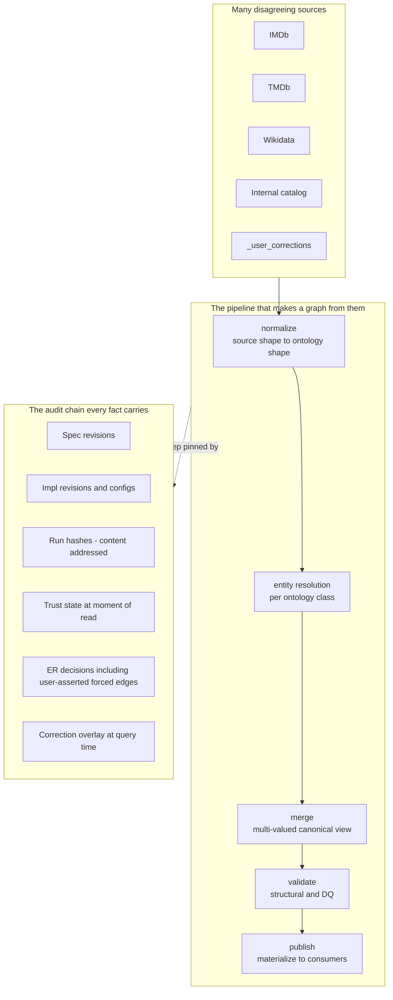

# Why knot exists

This layer establishes the problem space. No design content. The reader should finish convinced that the problem is correctly framed before any architectural commitment is examined.

---

## One-paragraph summary

A team building a knowledge graph from multiple, partially-redundant, partially-disagreeing data sources runs into the same load-bearing question over and over: **"why does the graph say X?"** Answering that mechanically — fast, deterministically, and walking back through every contributing source, every entity-resolution decision, every trust state, and every human correction — is not something any single existing system does end-to-end. The combinations that almost work either pick a winner too early (losing the disagreement evidence), keep audit information in a sidecar that drifts, or assume a posture (multi-tenant, hostile-author, plugin-marketplace) that produces complexity the team does not need. Knot exists because the *combination* of multi-source ER, query-time trust resolution, runtime-editable ontology, deterministic audit walk-back, and a single-team trust posture has no off-the-shelf answer — and the combination, not any single piece, is the hard part.

---

## What the team actually has on its hands

The problem domain is **multi-source knowledge-graph construction**, not "graph database" or "ontology authoring" or "ETL." Those are slices.

The full shape:

1. **Many sources** describing overlapping entities. IMDb, TMDb, Wikidata, an internal Netflix catalog, a few human-curated tables. Each has its own identifiers, its own value vocabulary, its own coverage holes, and its own opinions about properties that other sources also describe.
2. **Disagreement is normal**, not exceptional. `Movie.year`, `Movie.runtime`, `Person.birth_year` — sources will produce different values for the same canonical entity. Some of those disagreements are bugs in one source; some are real ontological differences (festival cut vs. theatrical cut runtime); some are stale records.
3. **Entity resolution** has to bridge source-natural keys into canonical IDs that downstream consumers can rely on. ER is wrong sometimes — it merges entities that shouldn't be merged, and splits entities that should stay merged — and those decisions need to be revisable without losing history.
4. **Trust is not uniform across a source.** IMDb is excellent for `runtime`, mediocre for `release_date` (it collapses festival / theatrical / regional dates into one). TMDb is strong for `franchise`, weaker for `genres`. Per-source trust loses too much information; the working unit is `(source, property)`. See [`trust-and-merge.md`](../../../design/trust-and-merge.md).
5. **The ontology evolves.** Slots get added, classes get split, constraints get tightened. Every spec edit changes which compiled workflows are valid; every published change has to be auditable.
6. **Humans correct things.** A senior data steward types "no, that's wrong" and the corrected value needs to surface immediately to consumers, persist into the lake at the next pipeline run, and remain attributable forever.
7. **Reads are cheap to misinterpret.** A consumer querying `Movie.year` for some canonical_id wants a single answer. They also need to be able to ask "where did that answer come from?" without leaving the system.

These seven facts are not independent. The combination is the work.

---

## The load-bearing question

Throughout this site, treat one question as the canary:

> **Why does the graph say `Movie.year = 1999` for canonical_id `mov_x9k2`?**

A correct, useful answer must walk back, deterministically, through:

- Which **published spec revision** was active when the value was produced.
- Which **compiled workflow run** produced the materialized value.
- Which **bound impls** (entity-resolution, materialization, query execution) participated, and at which **content-addressed revisions**.
- Which **sources** contributed `year` values for that canonical entity.
- Which **ER decision** bound the underlying source rows to that canonical_id (and whether any human-asserted forced edge or non-edge participated).
- Which **trust state** was in effect at the moment the read happened, and which contribution it picked as the default.
- Whether any **in-flight correction** in postgres-control was overlaid on top of lake data at query time.

If the answer to any one of those bullets is "we'd have to go look in the orchestrator's logs" or "you'd need to ask the person who wrote the ER strategy" or "we lost that when we re-ran the pipeline," the audit promise is broken. The reader should hold this as the litmus test for everything that follows.

The deep version of this question is in [`the-hard-problems.md`](the-hard-problems.md). The constraints that make it answerable are in [`constraints-and-posture.md`](constraints-and-posture.md). The honest comparison to systems that solve adjacent problems is in [`why-existing-systems.md`](why-existing-systems.md).

---

## The problem-space surfaces, at a glance

The pipeline is conventional in shape; almost every system in [`why-existing-systems.md`](why-existing-systems.md) handles some part of it. The non-conventional parts are:

1. **`per_source_facts` is not a staging table that gets dropped after merge.** It is the immutable truthful record of every claim every source ever made. The merge step does not pick a winner per property; it joins per-source-facts to canonical_ids and retains every contribution.
2. **The audit chain is not a sidecar.** It is data inside the same pipeline, pinned by the content-addressed compile hash. There is no separate lineage system to drift.
3. **Corrections are a regular source.** A human steward's "no, the year is 1999" lands in postgres briefly, then migrates to the lake at the next pipeline run via a dedicated source — and is overlaid at query time only for consumer-facing reads, never for impls.
4. **Trust is `(source, property)`, query-time, and revisable without re-running the pipeline.** Editing trust changes which contribution surfaces as the default; the multi-valued data does not move.

These four properties are what the rest of Layer 1 grounds, defends, and contrasts to the alternatives.

---

## What the reader should believe at the end of Layer 1

After reading the three pages below, the reader should hold the following five claims as well-established (not asserted-but-vague):

1. **The problem domain is multi-source knowledge-graph construction with disagreement, ER, trust, and audit walk-back as first-class concerns** — not as bolt-ons to a transformation pipeline.
2. **The single-team / no-tenants / runtime-editable / lake-first posture is a real constraint, not a fashion.** Each of the four properties dissolves a category of complexity that would otherwise force defensive infrastructure the team does not need.
3. **Existing systems each cover a slice of these concerns but no single one covers the combination** — and the combination, not any individual piece, is the hard part.
4. **The audit promise is the load-bearing user-facing benefit.** Everything else in the design flows from making it keepable.
5. **Multi-valued canonical facts with query-time trust resolution is non-obvious but genuinely necessary** given how trust evolves and how sources disagree.

If any of those five does not land for the reader, Layer 2's architectural commitments will not land either — because each commitment is downstream of one of those five.

---

## What this layer is *not*

- **Not a pitch.** No "powerful," "delightful," "comprehensive." The reader is technical and already knows the domain.
- **Not a design proposal.** Layer 1 establishes the problem; Layer 2 establishes the architectural commitments that solve it. Slipping "knot does X by Y" into this layer is a category error.
- **Not aspirational.** Every claim here either grounds in observed source-data behavior, in the audit promise, or in a system the reader can go look up. Inferred claims are flagged.
- **Not "every team."** Knot serves *one* team. The single-team posture is a real constraint that dissolves entire categories of complexity (sandboxing, multi-tenant safety, plugin versioning, marketplace dynamics). Treating that posture as a load-bearing constraint, not a "for now" simplification, is what makes the rest of the design tractable. See [`constraints-and-posture.md`](constraints-and-posture.md).

---

## How to read the rest of Layer 1

| Page | Establishes |
|---|---|
| [the-hard-problems.md](the-hard-problems.md) | What about this problem space is not trivial. Why ER + multi-source disagreement + trust + audit walk-back compound rather than decompose. |
| [constraints-and-posture.md](constraints-and-posture.md) | The single-team / no-tenants / runtime-editable / lake-first / audit-promise posture, as a deliberate set of constraints, not a "for now" simplification. |
| [why-existing-systems.md](why-existing-systems.md) | Honest factual comparison. What dbt, DataJunction, LinkML, SHACL, OWL, Splink, Atlas, and Neo4j do and don't address. Where each one covers a slice; where the combination falls through the cracks. |

The layer is done when the reader believes the problem is correctly stated. The "how" comes next.
