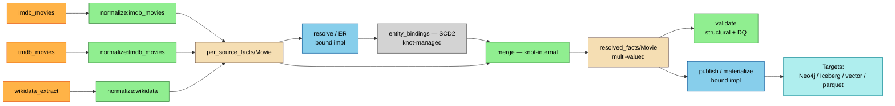
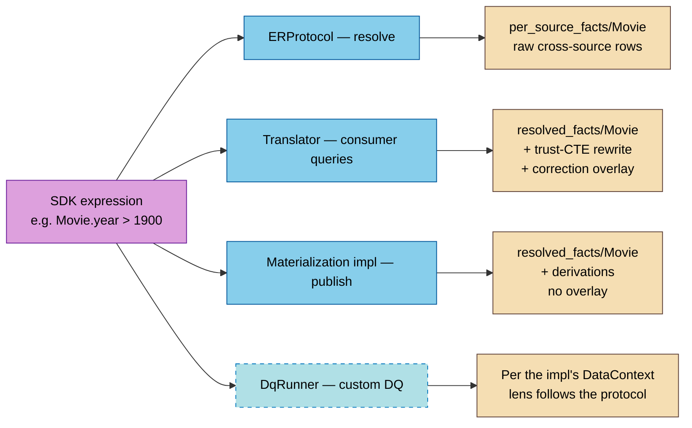
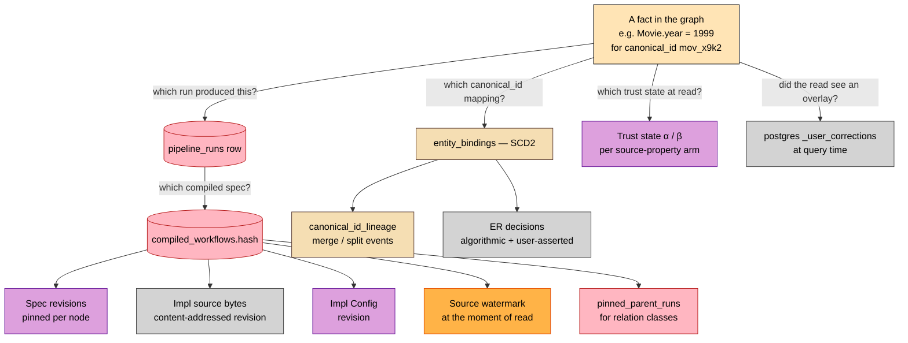

# Architecture overview

A single page that shows what knot is made of and how the pieces fit. Read this first if you want the shape; read the layers if you want the argument.

---

## Legend

| Color | Category | Examples |
|---|---|---|
| **purple** | Ontology / spec entities | OntologyClass, Slot, Constraint, TypeDefinition, ER config |
| **orange** | Sources (team-owned ingestion) | imdb_movies, tmdb_movies, wikidata_extract |
| **green** | Pipeline stages (compiled by knot, dispatched to orchestrator) | normalize, resolve (ER), merge, validate, publish |
| **blue** | Bound DI impls (required for the team's case) | ERProtocol, Materialization, QueryReader |
| **light blue (dashed)** | Bound DI impls (optional) | DqRunner (custom checks), Notifier |
| **grey** | Knot-internal machinery (control plane) | compiler, publish gate, registration, postgres-control |
| **tan** | Lake storage | per_source_facts, resolved_facts, entity_bindings |
| **teal** | Publish targets (downstream of materialization) | Neo4j, Iceberg, vector store, parquet exports |
| **pale yellow** | External users (three narrow surfaces) | apps, analysts, correctors |
| **pink** | Audit chain (lineage back through pinned revisions) | compiled_workflows, pipeline_runs |

---

## The big picture

```mermaid
flowchart LR
    subgraph control[Knot control plane]
        direction TB
        subgraph spec[Spec layer]
            spec_rev[Spec revisions<br/>classes / slots / constraints / types]
            impl_src[Impl source bytes<br/>knot-hosted]
            impl_cfg[Impl configs<br/>runtime-editable]
            dq_cfg[Built-in DQ config]
        end
        subgraph gates[Compiler + gates]
            registration[Impl registration<br/>DataContext walk]
            publish_gate[Publish gate<br/>reflective validation]
            compiler[Compiler<br/>pure transform]
        end
        subgraph audit_store[Audit store]
            cw[compiled_workflows]
            pr[pipeline_runs]
            u_corr[_user_corrections<br/>_user_er_decisions]
        end
    end

    subgraph orchestrator[Orchestrator — external]
        maestro[Maestro / Airflow / Argo / toy]
    end

    subgraph stages[Pipeline stages — dispatched per compile]
        direction TB
        normalize[normalize]
        resolve[resolve / ER]
        merge_stage[merge — knot-internal]
        validate[validate — structural + DQ]
        publish_stage[publish / materialize]
    end

    subgraph di_seam[DI seam — bound impls]
        direction TB
        subgraph domain_impls[Domain impls]
            er_impl[ERProtocol<br/>per class]
            mat_impl[Materialization<br/>per target]
            translator[Translator<br/>consumer queries]
            dq_impl[DqRunner<br/>custom — optional]
            notifier[Notifier — optional]
        end
        subgraph qx[QueryExecutor protocols]
            qr[QueryReader]
            mz[Materializer]
            intro[Introspector]
            vm[ViewManager]
        end
    end

    subgraph lake[Lake — Spark / Trino / Iceberg / postgres-backed]
        direction TB
        psf[per_source_facts/&#60;Class&#62;/source=&#60;X&#62;]
        rf[resolved_facts/&#60;Class&#62;<br/>multi-valued]
        eb[entity_bindings — SCD2]
        lin[canonical_id_lineage]
        mv[Materialized DataContext views]
    end

    subgraph targets[Publish targets]
        neo[Neo4j]
        ice[Iceberg analytics]
        vec[Vector store]
        pq[Parquet / CSV]
    end

    subgraph team_ingest[Team-owned ingestion — out of scope]
        team_jobs[Batch jobs / Kafka / scrapers]
    end

    subgraph external_users[External users — three narrow surfaces]
        apps[Apps / services]
        analysts[Analysts]
        correctors[Correctors via UI]
    end

    %% spec → compile → audit
    spec_rev --> publish_gate
    impl_src --> registration
    impl_cfg --> publish_gate
    registration --> publish_gate
    publish_gate --> compiler
    compiler --> cw
    compiler -.WorkflowSpec.-> maestro

    %% orchestrator dispatch
    maestro -.dispatches.-> stages
    maestro -.run handle.-> pr
    pr -.refs.-> cw

    %% stages → impls
    resolve -.calls.-> er_impl
    publish_stage -.calls.-> mat_impl
    validate -.optional.-> dq_impl
    publish_gate -.alerts via.-> notifier

    %% reads / writes via QueryExecutor
    er_impl -.via.-> qx
    mat_impl -.via.-> qx
    dq_impl -.via.-> qx
    validate -.built-in DQ via.-> qx
    merge_stage -.knot SQL via.-> qx
    translator -.via.-> qx
    qx -.SQL.-> lake

    %% sources land
    team_jobs --> psf

    %% data flow in the lake
    psf --> resolve
    resolve --> eb
    eb --> merge_stage
    merge_stage --> rf
    rf --> validate
    rf --> publish_stage
    publish_stage --> targets
    eb -.merge / split.-> lin

    %% corrections — two paths
    correctors -.submits.-> u_corr
    u_corr -.next run via _user_corrections.-> psf
    u_corr -.query-time overlay.-> translator

    %% consumer paths
    apps --> targets
    analysts --> translator

    %% styling
    classDef ontology fill:#DDA0DD,stroke:#6A1B9A,color:#000
    classDef source fill:#FFB347,stroke:#E65100,color:#000
    classDef stage fill:#90EE90,stroke:#2E7D32,color:#000
    classDef impl_required fill:#87CEEB,stroke:#01579B,color:#000
    classDef impl_optional fill:#B0E0E6,stroke:#0277BD,stroke-dasharray:5,color:#000
    classDef knot_internal fill:#D3D3D3,stroke:#424242,color:#000
    classDef lake_data fill:#F5DEB3,stroke:#5D4037,color:#000
    classDef target fill:#AFEEEE,stroke:#00838F,color:#000
    classDef external fill:#FFFFE0,stroke:#827717,color:#000
    classDef audit fill:#FFB6C1,stroke:#B71C1C,color:#000

    class spec_rev,impl_cfg,dq_cfg ontology
    class team_jobs source
    class normalize,resolve,merge_stage,validate,publish_stage stage
    class er_impl,mat_impl,translator,qr,mz,intro,vm impl_required
    class dq_impl,notifier impl_optional
    class compiler,publish_gate,registration,impl_src,u_corr knot_internal
    class psf,rf,eb,lin,mv lake_data
    class neo,ice,vec,pq target
    class apps,analysts,correctors external
    class cw,pr audit
```

Things to read off this diagram:

- **Sources land in the lake outside knot.** The `team_jobs → per_source_facts` edge is the only one that crosses *into* knot's responsibility from the team's ingestion infrastructure. Knot starts at `normalize`.
- **Knot is a compiler.** The `compiler → WorkflowSpec → orchestrator` chain is the only path from spec to execution. The orchestrator is external. Knot has no internal queue or scheduler.
- **One DI seam, many bindings.** ER, materialization, custom DQ, translator, notifier, the four QueryExecutor protocols — all follow the same protocol + DataContexts + Config + pure-data ctx pattern.
- **Knot-internal work uses the same seam.** Merge SQL, built-in DQ checks, structural validation, materialized DataContext views — all dispatch through the bound `QueryReader` / `Materializer` / `ViewManager`. Knot has no SQL engine of its own.
- **Corrections take two paths.** Postgres-control overlay at query time for consumers; migration into the lake at next pipeline run via the `_user_corrections` source for everyone else.
- **Audit lives in the system.** `compiled_workflows` (content-addressed) + `pipeline_runs` (run records) + SCD2 `entity_bindings` + `canonical_id_lineage` are the data-shaped audit chain. No sidecar.
- **Knot emits per-stage cache flags.** Each stage in the `WorkflowSpec` carries a content-addressed cache key; the orchestrator skips stages whose key matches a prior successful run and propagates "unchanged" forward through the toposort. See [`design/staging/incremental-execution.md`](../../design/staging/incremental-execution.md).

---

## Pipeline flow (zoomed in)

For a relation class like `Credit` (whose slots reference Movie + Person), the resolve stage additionally pins the parent run hashes for Movie and Person at compile time and reads parent canonical_ids "as of" those pinned runs. See [`design/staging/cross-class-pinning.md`](../../design/staging/cross-class-pinning.md).

---

## Lens semantics — same SDK expression, different backing tables

The same `Movie.year > 1900` expression resolves to different tables depending on which protocol the impl implements. The impl writer never chooses the lens; knot's runtime materializes the right view per protocol.

- `ERProtocol` reads **raw multi-source rows** because that's what ER scores against. Its `disagreement_stance` is `DISAGREEMENT_AWARE` — slots are `MultiValued[T]` and bare `Movie.year > 1900` is a type error; the impl must spell its reduction.
- `DqRunner` is likewise `DISAGREEMENT_AWARE` — cross-source agreement is half the built-in checks; silent trust-winner comparison would hide the disagreement the check exists to detect.
- `Translator` reads **trust-resolved + correction-overlaid** because consumers want fresh single values. Its `disagreement_stance` is `RESOLVED` — slots are `Resolved[T]`, bare comparisons compile.
- Materialization impls read **post-merge canonical entities + derivations** because publish writes the single canonical view to a downstream target. `RESOLVED`; no overlay.
- Custom `DqRunner` reads at the protocol's natural lens (`DISAGREEMENT_AWARE`).

The trust-CTE rewrite and correction overlay apply **only** at the consumer-facing translator path. Pipeline impls (ER, merge, validate, materialize) never see the overlay; their DataContext views are pure lake reads at the pinned moment, so replay stays deterministic. Under `RESOLVED` protocols, bare `Movie.year > 1900` compiles to a `Compare` node over the trust-resolved view; under `DISAGREEMENT_AWARE` protocols it does not.

See [`design/staging/multi-valued-semantics.md`](../../design/staging/multi-valued-semantics.md) for the canonical per-protocol assignment, [`design/staging/auto-generated-sdk.md`](../../design/staging/auto-generated-sdk.md) §"Reuse across contexts — lens semantics", and [`design/staging/di-input-contract.md`](../../design/staging/di-input-contract.md).

---

## Audit walk-back — from any fact to the artifacts that produced it

Every contributing artifact is *pinned at run time* in `compiled_workflows.spec`. Audit is mechanical because the hash dereferences to every pinned revision; the pinned revisions dereference to the actual specs / impls / configs that were active.

This is the load-bearing user benefit. See [`1-why/the-hard-problems.md` §"Audit walk-back is the load-bearing user benefit"](1-why/the-hard-problems.md#hard-problem-5-audit-walk-back-is-the-load-bearing-user-benefit) and [`2-commitments/1-foundation.md` §"Commitment 3"](2-commitments/1-foundation.md#commitment-3--content-addressed-compile-hashes-are-run-identity).

---

## What's required vs optional

For a minimal team-owned deployment:

| Required | Why |
|---|---|
| At least one source declared (mapping to at least one ontology class) | Knot starts at normalize; without sources, nothing to normalize. |
| `QueryReader` + `Materializer` + `ViewManager` bindings | Knot-internal machinery (merge, built-in DQ, materialized views) needs them. |
| `ERProtocol` impl per ontology class with multiple sources | Single-source classes are degenerate ER (pass-through); multi-source is where ER work happens. |
| At least one materialization impl (per published target) | Otherwise the data sits in the lake and isn't published. |

| Optional | When you'd add it |
|---|---|
| `Introspector` | If a binding can't infer column metadata for itself; otherwise inferred. |
| Custom `DqRunner` | If built-in DQ doesn't cover a domain check the team needs. |
| `Notifier` | If the orchestrator's native alerting isn't enough. |
| `Translator` | If consumers query the ontology via knot's API rather than reading materialized targets directly. |

---

## Where this overview connects to the rest

- For *why* each piece exists: [Layer 1 — Why knot exists](1-why/index.md).
- For the *architectural commitments* each piece embodies: [Layer 2 — Architectural commitments](2-commitments/index.md).
- For the *canonical design docs*: `../../design/` — `goals.md`, `core-design.md`, `compiled-workflow-hashing.md`, `source-layer-contract.md`, plus the `staging/` working drafts.

This page is a reference; the layers are the argument.
